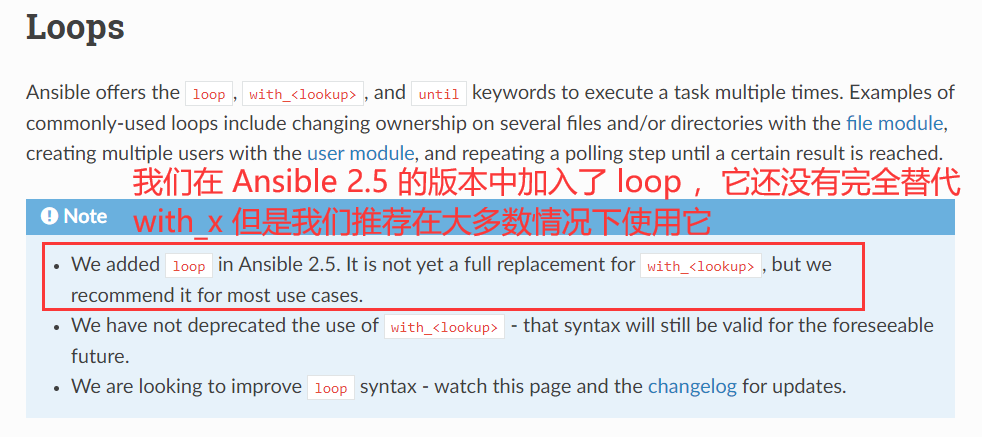

# Ansible-Playbook 编写学习 —— ES 集群部署（2023.8.13）


# 一、Ansible 基本概念

Ansible是一种自动化配置管理工具，用于自动化执行配置和管理任务。它通过SSH协议连接到远程主机，并使用轻量级的模块化任务来实现配置管理和操作。

在深入学习 Ansible 之前 ，我们需要了解 Ansible 的一些重要概念：

- **控制节点（Control Node）**

  控制节点是Ansible的管理端，用于编写、配置和执行Ansible Playbook任务。控制节点上需要安装Ansible软件，并且可以使用几个命令行工具（如ansible、ansible-playbook、ansible-galaxy等）来管理和控制远程主机。

- **远程节点（Managed Nodes）**
远程节点是指需要通过Ansible进行配置管理和操作的目标主机。可以在控制节点上定义一个清单文件（Inventory），列出所有远程节点的连接信息（IP地址、用户名、密码等）。Ansible会连接到这些远程节点执行任务。

- **主机清单（Inventory）**

  主机清单是一个文本文件，列出了Ansible控制节点可以管理的远程主机的连接信息。这些信息包括主机名、IP地址、用户名、密码等。

- **剧本（Playbook）**

  Playbook是Ansible的核心配置文件，采用YAML格式编写。它定义了一系列任务和配置，用于在远程主机上执行特定的操作。Playbook可以包含变量定义、主机清单、任务列表、条件判断、循环控制等。

- **角色（Roles）**

  角色（Roles）： 角色是一种组织和重用Playbook的方式。它将相关的任务、变量和文件组织到一个目录结构中，以便更好地管理和组织Ansible代码。

- **模块（Modules）**

  模块是Ansible的基本执行单元，用于在远程主机上完成特定的操作。每个模块负责执行一项特定的任务，如文件操作、软件包管理、用户管理等。Ansible提供了丰富的内置模块。

- **任务（Task）**
  
  任务是在Playbook中定义的一个单独的操作单元。每个任务包含一个或多个模块调用，并指定所需的参数。任务描述了要在远程主机上执行的具体操作。
  
- **变量（Variables）**
  
  变量用于在Ansible中存储和管理数据。可以定义全局变量、主机变量和组变量。变量可以用于配置任务、指定模块参数、进行条件判断等。
  
- **模板（Templates）**

  模板使用Jinja2模板语言，允许根据变量动态生成配置文件。可以将模板与Ansible结合使用，以便根据特定需求生成自定义配置文件。


- **外部文件（Files）**

  外部文件用于存储需要从控制节点传输到远程主机的文件。这些文件可以是脚本、配置文件、密钥等。Ansible提供了copy和template模块来处理外部文件的传输和生成。

除了上述概念外，Ansible还支持条件判断、循环控制、事件回调等高级功能，以及插件和动态发现等扩展性特性。


# 二、安装 Ansible

由于生产环境中一般都是使用 Linux 系统，本次学习要完成的项目—— ES 集群部署也是在四台 Linux 虚拟机上进行的，所以本节描述如何在 CentOS 7 上安装 Ansible。

首先介绍一下本次学习项目所用的主机环境：

| 节点         | IP地址          | 说明                                            |
| :----------- | :-------------- | :---------------------------------------------- |
| Control_node | 192.168.109.128 | 安装 Ansible 的主机，控制节点（Control Node）   |
| master       | 192.168.109.132 | ES 集群的 master 节点，被控节点（Managed Node） |
| node01       | 192.168.109.133 | ES 集群的  data 节点，被控节点（Managed Node）  |
| node02       | 192.168.109.135 | ES 集群的  data 节点，被控节点（Managed Node）  |


**我们只需在上表中的 Control_node 节点安装 Ansible 来控制其余三台主机即可**。本次学习 ES 集群部署使用了一个主节点（master）和两个数据节点（node01，node02）。多台主机是为了学习 ansible-playbook 数组和循环的使用，如果资源有限，使用两台主机也可以完成本次集群部署（ES集群部署最少只需一个 master 节点和一个 data 节点，然后将该 master 节点作为 ansible 控制节点，同时控制自身和 data 节点来完成 ES 集群部署）。

```shell
# 下载阿里云 epel 源配置文件
curl -o /etc/yum.repos.d/epel.repo http://mirrors.aliyun.com/repo/epel-7.repo

# 清除并更新 yum 缓存
yum clean all && yum makecache

# 安装 Ansible
yum install -y ansible

# 查看 Ansible 版本
ansible --version

# 本次学习所用到的版本
ansible 2.9.27
  config file = /etc/ansible/ansible.cfg
  configured module search path = [u'/root/.ansible/plugins/modules', u'/usr/share/ansible/plugins/modules']
  ansible python module location = /usr/lib/python2.7/site-packages/ansible
  executable location = /usr/bin/ansible
  python version = 2.7.5 (default, Oct 30 2018, 23:45:53) [GCC 4.8.5 20150623 (Red Hat 4.8.5-36)]

```


# 三、配置主机清单（inventory）

**Ansible 的主机清单文件（也称为 inventory）是一个文本文件，用于定义 Ansible 将要管理的远程主机和主机组以及相关的变量**。下面是本次学习所构建的主机清单：

```shell
# 安装 ansible 后，默认在 /etc/ansible/hosts 配置主机清单
vim /etc/ansible/hosts

# 可以设置单独的不属于任何主机组的主机，示例如下
# hostname1 ansible_host=192.168.109.128 ansible_user=root ansible_password=123

# 可以设置主机组,调用组名即可控制组中所有主机按顺序执行相应任务
[es]
master ansible_host=192.168.109.132 
node01 ansible_host=192.168.109.133 http.port=9201 transport.port=9301
node02 ansible_host=192.168.109.135 http.port=9202 transport.port=9302

# 使用[主机组名:vars]的方式可以设置主机组所要用到的变量，后期编写 Playbook 时可以直接调用
[es:vars]
ansible_user=devops
ansible_password="123456" 
ansible_ssh_args='-o StrictHostKeyChecking=no'

# sudo 提权相关，后面会详细说明
ansible_become_method=sudo
ansible_become=yes
ansible_become_password='123456'

```

上述示例中包含了不同类型的清单格式和参数：

- `主机名` 指定主机组中的一个具体主机，并可以使用 `ansible_host` 指定主机的 IP 地址。
- `[主机组名]` 定义了一个主机组。
- `ansible_user` 指定使用ssh连接主机所使用的用户名。
- `ansible_password` 指定使用ssh连接主机所使用的密码，在 ansible 2.4 之后的版本可以使用 `ansible_ssh_pass`来代替，它们的作用是相同的。如果密码中含有特殊符号，可以使用单引号或双引号将密码括起来。
- `http.port` 和 `transport.port` 是我自定义的变量，在集群部署中将被用到。
- `[主机组名:vars]` 定义了一个主机组级别的变量。当我们有N台主机的时候，如果它们的 `ansible_user` 和 `ansible_password` 的值都是⼀样的，那么我们要重复写N次这些变量，这样的做法是不够简洁的，因此可以将 `ansible_user` 和 `ansible_password` 在主机组变量中定义。

在 Ansible 的主机清单文件中，单个主机，主机组，主机组的变量之间的顺序并不会影响 Ansible 的执行，可以按照自己的习惯进行排列。比如：你可以将单个主机放在所有主机组的前面或者后面，也可以将所有的变量放在所有主机组的后面。它们之间没有严格的优先级关系，Ansible 在执行任务时会读取你在 Playbook 中声明所要用到的主机组来按照清单文件中定义的顺序逐个处理主机。

**注意**：后定义的变量会覆盖先定义的变量，包括主机名。例如：我先在 `[es]` 这个主机组中定义了一个 `node01`，如果我在后面的一个 `[new]` 组中也定义了一个主机叫 `node01`，那么 `ansible` 会读取 `[new]` 组 `node01` 的变量值，包括 `ansible_host`，`http.port`，`transport.port`


## 1、主机清单中的变量

Ansible 的主机清单文件中的变量可以分为**预定义变量**和**自定义变量**两种。它们可以在主机组部分中使用 `[主机组:vars]` 来定义，也可以在单个主机行中定义。

**预定义变量**是 Ansible 内置的特殊变量，用于提供关于主机和连接的信息。这些变量通常以 `ansible_` 前缀开头，并具有特定的含义，如 `ansible_host`、`ansible_user` 等。

**自定义变量**允许您在主机清单文件中定义自己的变量，并将其与特定的主机相关联。例如本次用到的`http.port` 和 `transport.port`，你可以对变量自由命名。


## 2、关于提权

某些场景下我们需要使⽤ root ⽤户去执⾏ task，但处于安全或者是合规等要求⽆法使⽤ root 直接登录主机，此时就需要使⽤提权来将普通⽤户提升⾄root⽤户权限。 

提权的⽅式有两种，⼀种是使⽤ `su` 提权，另⼀种是 `sudo` 提权。

su 提权需要有 root 密码，⽽实际生产中我们可能不会得到 root 密码。

sudo 提权则是需要 root 用户提前配置好 sudo 文件，赋予特权用户 sudo 权限。


- 在实际生产环境中，我们一般会得到一个普通用户，并且已被赋予 sudo 权限，例如本次我们连接被控主机所用到的用户 `devops` 就是一个具有 sudo 权限的特权用户。为了模拟生产环境进行学习，我们需要在 ES 集群的三台主机（master,node01,node02）中为自己创建 `devops` 用户并赋予 sudo 免密权限：

  ```shell
  # 创建用户
  useradd devops
  
  # 设置密码
  echo 123456 | passwd --stdin devops
  
  # 添加 sudo 免密权限，本次采用的是在 sudoer.d 目录下新建文件来授予权限。
  # 也可以使用 visudo 命令直接编辑默认的 sudoers 文件，添加和下面文件中相同的内容即可。
  export NAME=devops
  
  tee /etc/sudoers.d/$NAME << EOF
  $NAME ALL=(ALL) NOPASSWD: ALL
  EOF
  
  # 使用 % 可以赋予用户组 sudo 权限，例如 %devops ALL=(ALL) NOPASSWD: ALL
  ```
  
  

**现在我们来解释一下主机清单中提权相关的参数**：

- `ansible_become_method` 定义我们提权的方式，可以是 su 或者 sudo 。
- `ansible_become=yes` 表示在远程主机上将使用特权用户身份执行任务。
- `ansible_become_password='123456'` 如果使用 su 提权，这里需要填写 root 密码。如果是使用 sudo 提权，这里需要填写当前用户的密码（前提是当前用户是特权用户）。本例中的当前用户 `devops` 就是一个特权用户，所以这里填写的密码其实和上面 ssh 远程登录被控主机的密码一样。
-  `ansible_become_user` 大多数情况下都不需要指定该参数，我们只需要分清它是用于指定提权之后变成的用户（默认为 `root` ），而不是指定当前需要提权的用户。


# 四、Playbook 基本语法

Playbook 是 Ansible 中用于描述配置和部署任务的文件，在编写 YAML 格式的 Playbook 时，需要注意以下语法要求：

1. **通过缩进表示层次结构**：通常建议使用两个空格或四个空格作为缩进级别。从 Ansible 2.10 版本开始，`playbook` 支持使用 `Tab` 键缩进。

2. **键值对的冒号后面需要加一个空格**：在键值对中，冒号后面应该留一个空格。

3. **列表使用连字符和缩进**：在列表中，每个项前面使用连字符 `-` 并缩进一个层次。列表在 Playbook 的编写中非常常见，当你想在一个关键字下定义多个值时都可以尝试使用 `-` 来进行多行定义。

4. **多行字符串**：可以使用管道 `|` 或大于符号 `>` 表示多行字符串。

5. **注释使用 `#` 符号**：注释以 `#` 开头，可以单独一行也可以在同行指令之后。

6. 如果需要将多段yaml配置放在一个文件中，中间要使用 `---` 分隔

   

以下是一个简单的 Playbook 模板，使用 `ping` 模块来向 `[es]` 主机组中的 `node01` 主机发送 ping 请求：

```yaml
---
- name: 简单的 Playbook
  hosts: node01  # 执行本次任务的主机或主机组
  gather_facts: false

# 任务内容
  tasks:
    - name: 发送 ping 请求
      ping:                # ping 模块不需要加参数

```

在上面的示例中：

- `name` 字段用于描述任务的名称和目的。
- `hosts` 字段指定要执行任务的主机或主机组。
- `gather_facts` 指定是否收集主机的事实（ `facts` ）。事实是关于主机的信息，例如 IP 地址、操作系统类型、可用内存等。默认情况下，Ansible 在运行 playbook 之前会自动收集主机的事实。这些事实存储在特殊的变量 `ansible_facts` 中，并可以在 playbook 中使用。例如，可以通过 `ansible_facts['ansible_hostname']` 获取主机名。但是，有时在某些场景下，可能并不需要收集主机的事实，或者已经使用其他方法获取了所需的信息。这时可以通过将 `gather_facts` 设置为 `false`，来禁用事实的收集。这样可以提高执行速度，尤其是在大规模部署时。
- `tasks` 字段包含一个任务列表。在此示例中，只有一个任务。
- 该任务使用 `ping` 模块，它会向指定的主机发送 ping 请求。


# 五、Playbook 模块化与常用模块

Ansible 提供了模块化的方式来组织和管理 Playbooks。通过将 Playbook 拆分为多个独立的任务文件和角色，可以提高代码的可重用性和可维护性。

⼀个书写良好且逻辑清晰的 `Playbook` ⽂件应该满足如下要求： 

1. 变量与要执⾏的任务应该区分 ；

2. `task` 应该单独抽离为⼀个⽂件并通过 `include_tasks` 或者是 `import_tasks` 来加载到 `Playbook` 中，⽽不是写在被执⾏的 `Playbook` ⽂件中； 

3. 减少重复的动作，尽量⼀次完成（后续会以 `yum` 模块做说明为什么需要减少重复的动作）；

4. 如果⼀个操作有幂等的模块，则应该使⽤幂等的模块去完成这个操作，⽽不是使用非幂等的模块去完成，如应该使⽤ `file` 模块创建⽂件夹⽽不是使⽤ `shell` 模块创建 。

**幂等性**：指的是多次执⾏返回的结果都是⼀样的，例如 `file` 模块创建⽂件或者⽂件夹，如果⽂件不存在则会创建，如果⽂件存在则不会创建，由于创建⽂件后不论执⾏多少次 `file` 模块均不会再次创建这个⽂件，所以说 `file` 模块是幂等的。


## 00、`include` 与 `import` 

在 Ansible 中，`include` 和 `import` 是两种不同的指令，用于在 Playbook 中包含其他文件。

1. `include`：`include` 指令是一个动态指令，它在运行时根据条件来包含任务文件或变量文件。这意味着 `include` 可以在 Playbook 执行期间根据需要动态地包含其他文件。例如，可以基于某些条件来选择是否包含某个任务文件。

   想象一下你有一个电子商务网站的主页文件，其中包含商品展示、新闻公告等模块。你可以使用 `include` 将这些模块的内容包含到主页文件中。这样，当你修改商品展示或新闻公告时，只需修改对应的模块文件，而不需要修改主页文件。

   ```yaml
   - include: tasks.yml
     when: some_condition
   ```

   在上述示例中，`tasks.yml` 文件将在 `some_condition` 条件满足时被包含。如果 `some_condition` 返回为真，那么 `tasks.yml` 中的任务将会被执行。

2. `import`：`import` 指令是一个静态指令，它在 Playbook 的编译时就会导入其他文件。这意味着 `import` 在 Playbook 开始执行之前就会将其他文件导入。与 `include` 不同，`import` 不会受到条件语句的影响，它会始终在 Playbook 执行之前导入指定的文件。

   比如你有一个 Python 程序，其中需要使用一个名为 "math_utils.py" 的自定义数学工具库。你可以使用 `import` 来导入这个库，并在程序中调用其中的函数来进行数学计算，而无需重复编写这些函数。

   ```yaml
   - import_tasks: tasks.yml
   ```

   在上述示例中，`tasks.yml` 文件将始终在 Playbook 执行之前被导入，并且其中的任务将会按顺序执行。

需要注意的是，`import` 在引入任务文件时会创建一个新的命名空间，而 `include` 则会共享相同的命名空间。这意味着，`include` 可以访问当前 Play （当前 task ）的变量，而 `import` 则无法直接访问。

总结起来，`include` 用于将内容复制粘贴到另一个文件中，避免重复编写相同的任务和变量，适用于可能需要经常需要修改的动态文件；而 `import` 用于引用另一个独立的文件或功能模块，以便在需要时调用和执行，适用于构建好的静态功能模块。

最佳实践是优先使用 `import`，因为它在编译时执行，可以提供更可预测和可维护的 Playbook 结构。如果需要根据条件动态包含文件，才使用 `include`。

**使用 import_tasks 的写法**

```yaml
# main.yaml （主文件）
- hosts: all
  tasks:
    - import_tasks: install-nginx-task.yaml
        
# install-nginx-task.yaml （安装 nginx 任务文件）
- name: install nginx in redhat or centos
  yum:
    name: nginx
    state: latest
  when: ansible_os_family == "Redhat"
  
- name: install nginx in debian or ubuntu
  apt:
    name: nginx
    state: latest
  when: ansible_os_family == "Debian"
```

**使用 include_tasks 的写法**

```yaml
# main.yaml （主文件）
- hosts: all
  tasks:
    - include_tasks: install-nginx-{{ ansible_os_family | lower }}.yaml

# install-nginx-redhat.yaml （redhat 系统安装 nginx 任务文件）
- name: install nginx
  yum:
    name: nginx
    state: latest
    
# install-nginx-debian.yaml （debian 系统安装 nginx 任务文件）
- name: install nginx in debian or ubuntu
  apt:
    name: nginx
    state: latest
```

在⼤型⼯程或者是需要维护不同操作系统的 `yaml` 时推荐是根据操作系统编写 `tasks` 并使用 `include` 导⼊。


## 01、`yum` 模块

- 用途：管理 CentOS/RHEL 系统上的软件包。
- 常用参数：
- `name`（字符串，必填）：指定要安装的软件包名称。
- `state`（字符串）：指定软件包的期望状态。如 `present`（存在）、`absent`（不存在）、`installed`（已安装且不进行更新）、`latest`（最新版），默认值：`present` ，检查软件包状态并尝试安装最新版。
  - 当与循环一起使用安装多个软件包时，每个包都将单独处理（依赖检查等步骤），将列表直接传递给 `name` 选项会更有效，这就是之前所说的尽量一次完成，减少重复动作。

```yaml
- name: 安装多个软件包（推荐写法）
  yum:
    name:
      - package1
      - package2
      - package3
    state: latest
    
- name: 安装多个软件包（不推荐写法）
  yum:
    name: "{{ item }"
    state: latest
  loop:
    - kubectl
    - kubeadm
    - kubelet
    
```


## 02、`copy` 模块
- 用途：复制文件或目录（递归复制）到远程主机。
- 常用参数：
- `src`（字符串，必填）：指定要复制的源文件或目录的路径
- `dest`（字符串，必填）：指定目标路径或目录，即将文件复制到哪里。
- `mode`（字符串或整数）：设置目标文件的权限模式，默认值：文件系统默认权限。
- `owner`（字符串）：设置目标文件的所有者。默认值：当前用户。
- `group`（字符串）：设置目标文件的所属组。默认值：当前用户所属组。
- `force` （布尔型）指定是否强制复制文件，即使文件已经存在且完全一致。默认值： `no` 。
- `content`（字符串）：直接将内容写入目标文件，而不是复制源文件。

```yaml
- name: 复制文件或目录到远程主机
  copy:
    src: /path/to/source/file
    dest: /path/to/destination/
    mode: "0644"	# 权限为所有者可读写，其他用户只读
    owner: myuser
    group: mygroup
    force: no		# 若文件已存在，则跳过复制操作
    
- name: Copy content to a file
  copy:
    dest: /path/to/destination/file.txt
    content: |
      This is the content that will be copied to the destination file.
      It can include multiple lines and support line breaks.
      你可以在 content 中使用中文。
```

**关于目录的斜杠**：

```yaml
    - name: copy yum.repos.d files
      copy:
        src: yum.repos.d
        dest: /etc
```

上述例子中，`yum.repos.d` 是一个目录，我们没有在它的最后加上斜杠 `/` ，这样做会把 `yum.repos.d` 这个目录当作一个整体，包括其中的所有文件（包括子目录）复制到目标主机的 `/etc` 下，如果 `/etc` 下已经存在同名目录，即 `/etc/yum.repo.d` 这个目录已经存在，那么任务的执行结果是：把 `yum.repos.d` 目录下的所有文件（包括子目录）复制到 `/etc/yum.repo.d` 下，并且不会影响该文件夹中原有的文件。

如果我们在它的最后加上斜杠 `/` ，这样做不会把 `yum.repos.d` 这个目录当作整体，只会把它里面的所有内容复制到目标主机的 `/etc` 下。也就是说，即使目标主机的 `/etc/yum.repo.d` 目录已经存在，我们也只会把文件复制到 `/etc` 下，不会操作目标主机的 `/etc/yum.repo.d` 。


## 03、`template` 模块
- 用途：使用模板在远程主机上生成文件。它使用 Jinja2 模板引擎来替换模板中的变量，并生成最终的配置文件或其他文本文件。
- 常用参数：
- `src`（字符串，必填）：指定要用作模板的源文件路径，通常位于控制节点上。
- `dest`（字符串，必填）：指定生成的目标文件的路径，可以是控制节点上全局路径或远程主机上的路径。
- `mode`（字符串或整数）：指定生成的目标文件的权限模式。默认值：继承父目录的权限。
- `owner`（字符串）：指定生成的目标文件的所有者。默认值：继承父目录的所有者。
- `group`（字符串）：指定生成的目标文件的所属组。默认值：继承父目录的所属组。
- `backup`（布尔值）：指定是否创建原始文件的备份。默认值：False（不创建备份）。
- `force`（布尔值）：指定是否在目标文件已存在时进行强制覆盖。默认值：False（存在则跳过复制）。

```yaml
- name: Render a template file
  template:
    src: /path/to/template.j2
    dest: /path/to/destination/file.txt
    mode: '0644'
    owner: myuser
    group: mygroup
    backup: yes
    force: no
```


## 04、`file` 模块

- 用途：创建、修改或删除文件或目录。

- 常用参数：
- `path`（字符串，必填）：指定要操作的文件或目录的路径。
- `state`（字符串）指定文件或目录的状态，如 `touch` 、`directory`、`absent`（删除）等。默认值：不改变文件或目录的状态。
- `mode`（字符串或整数）：指定文件或目录的权限模式。默认值：继承父目录的权限。
- `owner`（字符串）：指定文件或目录的所有者。默认值：当前执行任务的用户。
- `group`指定文件或目录的所属组。默认值：当前执行任务的组。

```yaml
- name: 创建目录并设置权限和所有者
  file:
    path: /path/to/directory
    state: directory
    mode: "0755"
    owner: myuser
    group: mygroup
```


## 05、`service` 模块

- 用途：管理系统服务。
- 常用参数：
- `name`（字符串，必填）：指定要操作的服务的名称。
- `state`（字符串）：指定服务的状态，如 `started`、`stopped`、`restarted`。默认值：空字符串（不改变服务的状态）。
- `enabled`（字符串）：指定是否在系统启动时自动启动服务，默认为 `None` ，不改变自启动配置。
- `daemon_reload` 是否重新加载守护程序配置，默认为 `None` ，不重新加载。

```yaml
- name: 启动服务并设置自动启动
  service:
    name: apache2
    state: started
    enabled: true

- name: 停止服务并禁止自动启动
  service:
    name: apache2
    state: stopped
    enabled: false

- name: 重启服务并重新加载配置
  service:
    name: apache2
    state: restarted
    daemon_reload: true
```


## 06、`shell` 模块

- 用途：在远程主机上执行 Shell 命令。
- 常用参数：
- `become_user`（字符串）：指定执行当前任务的用户。

```yaml
- name: 执行多条简单命令
  shell: |
      command1
      command2
      command3

- name: 前一条命令失败后终止执行后续命令
  become_user: caas
  shell: |
      command1 &&
      command2 &&
      command3
      
- name: 执行多条较复杂命令，使用列表符-
  shell: |
      - command1 arg1
      - if [ -f file.txt ]; then
          command2 arg2;
        else
          command3 arg3;
        fi
      - for i in {1..5}; do
          command4 arg4;
        done

```


## 07、`blockinfile` 模块

- 用途：在文本文件中插入或替换一个区块。
- 常用参数：
- `path`（字符串，必填）：指定要操作的文件路径。
- `block`（字符串，必填）指定要插入或替换的块的内容。
- `marker`（字符串）：起始和结束标记，默认为 `"# {mark} ANSIBLE MANAGED BLOCK"`，而 `{mark}` 的默认值为 `begin` 和 `end` 。
- `state`（字符串）：块插入的状态，可以是插入（ `present` ）或移除（ `absent` ）
- `create`（布尔值）：是否在目标文件不存在时创建一个空的目标文件，默认值 `false`（不创建）。
- `backup`（布尔值）：是否在修改目标文件之前创建一个备份文件，默认为 `False`（不备份）。
- `insertbefore`（字符串）：指定在哪个行之前插入块内容，默认在文件末尾插入。
- `insertafter`（字符串）：指定在哪个行之后插入块内容，默认在文件末尾插入。

```yaml
- name: 使用blockinfile模块
  blockinfile:
    path: /path/to/file
    marker: "# {mark} ANSIBLE MANAGED BLOCK"
    block: |
      This is the block content.
      It can be multiple lines.
    backup: yes
    state: present
    insertafter: "line 5"
    create: yes

```


## 08、`lineinfile` 模块

- 用途：在文本文件中添加、修改或删除特定行。
- 常用参数：
- `path`（字符串，必填）：指定要进行操作的文件路径。
- `line`（字符串）：匹配要插入、修改或删除的目标行内容。
- `regexp`（字符串）：使用正则表达式匹配目标行内容。`line` 和 `regexp` 必填且只填一个。
- `state`（字符串）：指定目标行的状态。可以是`present`（存在）、`absent`（不存在）或 `delete`（删除）。
- `create`（布尔值）：如果文件不存在，是否创建新文件，默认为 `no`。
- `backup`（布尔值）：指定是否备份原始文件。默认值：False（不备份）。
- `insertbefore`（字符串）：指定要在其之前插入新行的目标行内容。默认值：插入到文件末尾。
- `insertafter`（字符串）：指定要在其之后插入新行的目标行内容。默认值：插入到文件末尾。

```yaml
- name: 在文件中确保某行存在
  lineinfile:
    path: /path/to/file
    line: 'Hello, World!'
    state: present

- name: 使用正则表达式匹配并替换行
  lineinfile:
    path: /path/to/file
    regexp: '^version:'
    line: 'version: 2.0'

- name: 在指定行之前插入新行
  lineinfile:
    path: /path/to/file
    line: 'New line to be inserted'
    insertbefore: '^# Existing line'

- name: 删除匹配的行
  lineinfile:
    path: /path/to/file
    regexp: '^old line'
    state: absent
```


## 09、`user` 模块

- 用途：管理系统用户。
- 常用参数：
- `name`（字符串，必填）：指定要创建或修改的用户的用户名。 
- `state`（字符串）：指定用户的状态。可以是`present`（存在）、`absent`（不存在）或`locked`（锁定）。 默认值：`present`。如果不设置该参数，默认会创建用户。
- `password`（字符串）：指定用户的密码（需要 hash 加盐）。 默认值：空字符串。如果不设置该参数，默认不会设置密码。
- `home`（字符串）：指定用户的主目录路径。 默认值：根据操作系统的规范自动生成主目录路径。
- `uid`（整数）：指定用户的用户标识符（UID）。 默认值：根据操作系统的规范自动生成 UID。

```yaml
- name: 创建用户
  user:
    name: myuser
    state: present
    password: "{{ 'mypassword' | password_hash('sha512') }}"
    home: /home/myuser
    uid: 1001

- name: 删除用户
  user:
    name: myuser
    state: absent
```


## 10、`hostname` 模块

- 用途：管理远程主机的主机名。
- 常用参数：
- `name`（字符串，必填）：指定要设置的主机名。 
- `update_hostname`（布尔值）：指定是否更新系统配置文件以永久保存主机名修改。 默认值：`yes`。如果设置为 `no`，则不会更新系统配置文件。
- `update_etc_hosts`（布尔值）：指定是否更新 `/etc/hosts` 文件以匹配新的主机名。 默认值：`yes`。如果设置为 `no`，则不会更新 `/etc/hosts` 文件。
- `reboot`（布尔值）：指定是否立即重启系统以使主机名修改生效。 默认值：`no`。如果设置为 `yes`，则会重新启动系统。

```yaml
# 主机清单中的一个主机组
[servers]
server1 ansible_host=192.168.1.10
server2 ansible_host=192.168.1.11
server3 ansible_host=192.168.1.12

# playbook 文件
- name: 按主机清单中的顺序批量修改主机名
  hostname:
    name: "{{ item }}"
    with_items: "{{ groups['servers'] }}"
    
```


## 11、`cron` 模块

- 用途：管理定时任务。
- 常用参数：
- `name`（字符串，必填）：指定要设置或删除的 cron 任务的名称。
- `job`（字符串，必填）：指定要在 cron 任务中执行的命令或脚本，最好使用绝对路径，并且使用双引号括起来。
- `user`（字符串）：指定执行 cron 任务的用户，默认值：当前用户。
- `state`（字符串）：指定 cron 任务的状态，可以是 `present`（存在）或 `absent`（不存在）。默认值：`present` 。如果设置为 `absent`，则会删除该 cron 任务。
- `minute`（字符串）：指定在每小时的第几分钟执行。默认值：`*` （每分钟）。
- `hour`（字符串）：指定在每天的第几小时执行。默认值：`*` （每小时）。
- `day`（字符串）：指定在每个月的第几天执行。默认值：`*` （每天）。
- `weekday`（字符串）：指定在每周的星期几执行。默认值：`*` （每天）。 `day` 和 `weekday` 只需设置其中一个，两个同时设置可能引起冲突。当设置了其中一个时，cron 不会考虑另一个。

```yaml
- name: 设置 cron 任务
  cron:
    name: my-cron-job
    minute: '30'
    hour: '9'
    day: '1'
    month: '1'
    user: root
    job: "/usr/bin/systemctl restart sshd"
    state: present
```


## 12、`debug` 模块

- 用途：调试 Ansible 任务，输出变量信息。
- 常用参数：
- `msg`（字符串）：要打印的调试信息。
- `var`（字符串）：指定要打印的变量。`msg ` 和 `var` 必填且只填一个。
- `verbosity`（整数）：控制调试信息的详细程度。可以是0，1，2，3或4。默认值：0，即只打印标准输出。

```yaml
- name: 输出在 inventory 中定义的当前主机名
  debug:
    var: inventory_hostname
    
- name: 输出自定义信息
  debug:
    msg: "这是自定义信息"
    
- name: 同时输出自定义信息和变量
  debug:
    msg: "我定义的变量是{{ myvar }}"
```


## 13、`unarchive` 模块

- 用途：解压缩文件或归档。
- 常用参数：
- `src`（字符串，必填）：指定要解压缩的源文件路径。
- `dest`（字符串，必填）：指定解压缩后的目标路径或目录。
- `remote_src`（布尔型）：指示源文件是否在远程主机上而不是本地主机上。默认值：`no` 。
- `owner`（字符串）：设置解压缩后的文件所有者。默认值：当前用户。
- `group`（字符串）：设置解压缩后的文件所属组。默认值：当前用户所属组。
- `extra_opts`（字符串）：提供额外的选项/标志，用于进一步自定义解压缩行为。

```yaml
- name: unarchive es
  unarchive:
    src: elasticsearch-7.17.11-linux-x86_64.tar.gz
    dest: "{{ item }}"
    owner: es
    group: es
    extra_opts:
      - --strip-components=1  # 去掉压缩包文件夹最外面那一层
  loop: "{{ dir_list }}"

```


## 14、`replace` 模块

- 用途：在文件中进行文本替换。
- 常用参数：
- `path`（字符串，必填）：指定要进行替换操作的文件路径。
- `regexp`（字符串，必填）：指定用于匹配要替换的文本的正则表达式。
- `replace`（字符串，必填）：指定替换匹配文本的字符串。
- `backup`（布尔值）：指定是否创建原始文件的备份文件。默认值：False（不创建备份）。

```yaml
- name: disable swap permanently
  replace:
    path: /etc/fstab
    regexp: '^(\s*)([^#\n]+\s+)(\w+\s+)swap(\s+.*)$'
    replace: '#\1\2\3swap\4'
    backup: yes

```


**经过总结可以发现，以下参数是在大多数模块中都可以选用的**：

1. `name`：指定要管理的资源的名称。
2. `state`：指定资源的状态，如 `present`（存在）或 `absent`（不存在）。
3. `enabled`：指定资源是否被启用，可选值为 `yes` 或 `no`。
4. `force`：强制执行操作，可选值为 `yes` 或 `no`。
6. `src`：指定源文件或目录的路径。
7. `dest`：指定目标文件或目录的路径。
8. `owner`：设置文件或目录的所有者。
9. `group`：设置文件或目录的所属组。
10. `mode`：设置文件或目录的权限模式。
11. `recurse`：递归地处理目录及其内容，可选值为 `yes` 或 `no`。
12. `remote_src`：指示 Ansible 在远程主机上查找源文件，可选值为 `yes` 或 `no`。
16. `content`：用于创建文件的内容。
24. `pattern`：用于匹配模式的字符串。
26. `command`：命令行命令或可执行文件的路径。
27. `creates`：如果路径已存在，则任务将被跳过。
33. `msg`：自定义消息。
34. `register`：将结果保存到变量中。
37. `loop`：对循环中的每个项执行操作。
38. `when`：指定任务执行的条件。


# 六、Playbook 变量与循环

在 Ansible Playbook 中，变量是用来存储和传递数据的工具。它们可以在 Playbook 文件中定义，并在任务中使用，常见的变量类型有**字符串**，**整数**，**列表**，**字典**等。

## 1、变量的定义和用法

在 playbook 中，可以使用以下方式定义变量：

1. **在主文件中使用 `vars` 关键字定义全局变量**。这些变量对 playbook 中的所有任务都可见。

   ```yaml
   - name: 示例任务
     hosts: localhost
     gather_facts: false
     vars:              # 可以灵活使用列表来定义变量
       - global_var: "This is a global variable"  # 字符串变量
       - global_var_list: 						   # 列表变量
         - var1
         - var2
         - var3
       
     tasks:
       - name: 打印全局变量
         debug:
           msg: "{{ global_var }}"
           
       - name: 打印全局变量列表
         debug: 
           msg: "{{ global_var_list }}"
   ```

   

2. **在任务中使用 `vars` 关键字定义任务级别的变量**。这些变量只在当前任务中可见。

   ```yaml
   - name: 示例任务
     hosts: localhost
     gather_facts: false
     tasks:
       - name: 定义任务级别的变量
         vars:
           task_var: "This is a task-level variable"
         debug:
           msg: "{{ task_var }}"
   ```

变量可以包含标量值（如字符串、数字等），也可以包含复杂的数据结构（如列表、字典等）。

**变量用法**：在 Playbook 中，我们通常使用`{{ 变量名 }}` 的语法来引用变量。

- 在任务中使用 Jinja2 模板语法`{{ 变量名 }}`引用变量的值。
- 在任务中使用 `register` 关键字将任务的输出保存到变量中，以便后续任务使用。
- 在任务中使用 `with_items`、`with_dict` 等循环结构遍历变量的值。
- 在任务中使用条件判断（`when` 关键字）根据变量的值执行不同的操作。
- 在模板文件中使用 `{{ 变量名 }}` 引用变量的值，生成动态的配置文件等。

变量的值可以来自于直接定义的值、来自 `inventory` 文件中的组和主机变量、引用外部变量文件、通过 `facts` 收集的主机信息、通过命令返回值等。

```yaml
# vars.yaml 变量文件
dir_list: 
  - "/home/es/master"
  - "/home/es/node01"
  - "/home/es/node02"

node_conf_list: 
  - { path: '/home/es/node01/config/elasticsearch.yml' , dest_host: 'node01' }
  - { path: '/home/es/node02/config/elasticsearch.yml' , dest_host: 'node02' }


# 在 main.yaml 中引用 vars.yaml 文件
- hosts: es
  vars_files: 
    - vars.yaml
  tasks: 
    - import_tasks: init.yaml
 
```

变量的定义和用法使得 Playbook 更加灵活和可配置。你可以根据需要在 Playbook 中定义和使用变量，便于重复使用和动态配置任务的行为。


## 2、列表和字典

**列表是一种有序的数据结构，可以包含多个元素。单行列表使用方括号 `[]` 来表示，其中的元素使用逗号 `,` 分隔，多行列表则使用短横线 `-` 排列**。

```yaml
# 单行列表，三个元素，如果有特殊符号应使用单引号或双引号括起来
my_list: [item1, "item2-with-special-character!", item3]

# 多行列表，注意缩进
my_list:
  - item1
  - "item2-with-special-character!"
  - item3
```

有特殊符号时使用单引号或双引号之间的选择取决于元素的内容和你希望如何解析特殊字符。如果你想让特殊字符保持原样且不被解析，可以使用单引号。如果您想要解析特殊字符（例如变量引用），则可以使用双引号。


**使用索引访问元素**：

列表中的元素根据它们的位置分配索引值，从 0 开始递增。可以使用索引值来访问特定位置的元素。以下是一个示例：

```yaml
- name: 示例任务
  hosts: localhost
  gather_facts: false
  tasks:
    - name: 打印列表项
      debug:
        msg: "{{ my_list[0] }}"
```

在上述示例中，我们使用索引值 `[0]` 来引用列表变量 `my_list` 中的第一个元素。通过更改索引值，可以访问不同位置的元素。

另外，还可以使用**切片（slicing）** 来获取列表的子集。以下是一个示例：

```yaml
- name: 示例任务
  hosts: localhost
  gather_facts: false
  tasks:
    - name: 打印列表切片
      debug:
        msg: "{{ my_list[1:3] }}"
```

在上述示例中，我们使用切片 `[1:3]` 引用列表变量 `my_list` 的第二个到第三个元素。切片包括起始索引位置的元素，但不包括结束索引位置的元素。

需要注意的是，如果使用索引超出了列表的范围，将会引发错误。因此，在使用索引时要确保它们在列表的有效范围内。


**字典是一种无序的数据结构，它由键（key）和对应的值（value）组成。在 YAML 中，可以使用花括号 `{}` 表示一个字典（键值对），并且在花括号中使用冒号 `:` 将键和值分隔开。多行字典则不需要使用花括号，但是要注意缩进**。

```yaml
# 单行字典，三个键值对，如果有特殊符号应使用单引号或双引号括起来
my_dict: {key1: value1, key2: 'value with special character!', key3: value3}

my_dict:
  key1: value1
  key2: 'value with special character!'
  key3: value3
```


**使用键访问值**：

可以使用键来引用字典中的特定值。通常使用点号 `.` 或者中括号 `[]` 。以下是示例：

```yaml
- name: 示例任务
  hosts: localhost
  gather_facts: false
  tasks:
    - name: 打印字典值
      debug:
        msg: "{{ my_dict.key1 }}"
       
```

```yaml
- name: 示例任务
  hosts: localhost
  gather_facts: false
  tasks:
    - name: 打印字典值
      debug:
        msg: "{{ my_dict['key2'] }}"
```

第二个示例中使用中括号 `[]` 和引号 `'key2'` 来引用字典变量 `my_dict` 中的值。这种方式适用于键名中包含特殊字符或空格的情况。

需要注意的是，如果使用不存在的键来访问字典的值，将会引发错误。因此，在使用键时要确保它们存在于字典中。


还可以将变量和数据结构嵌套在一起，例如在列表中包含字典或在字典中包含列表。

```yaml
dict_in_list:
  - name: Item 1
    value: 10
  - name: Item 2
    value: 20
    
list_in_dict:
  key1:
    - item1
    - item2
    - item3
  key2:
    - item4
    - item5
```


## 3、循环与迭代关键字

Ansible 提供了很多**循环**和**迭代**模块，将它们与**列表**和**字典**结合使用可以实现更灵活的配置和操作。

在较新版本的 Ansible 中，`with_items`、`with_dict`、`with_fileglob`、`with_sequence`、`with_nested` 和 `with_lines` 等关键字已经被更通用和统一的 `loop` 关键字替代。我们可以使用 `loop` 来代替这些旧关键字的功能，以实现循环迭代。

### 3.1  `loop`

`loop` 关键字是 Ansible 2.5 版本引入的功能，用于在任务中执行循环。我们可以在任务中指定一个任务列表，该列表将在每次迭代中执行。

```yaml
- name: 示例任务
  hosts: localhost
  gather_facts: false
  vars:
    colors:
      - red
      - green
      - blue
    sizes:
      - small
      - medium
      - large
  tasks:
    - name: 任务 1
      debug:
        msg: "颜色：{{ item }}, 尺寸：{{ sizes[0] }}"
      loop: "{{ colors }}"
    
    - name: 任务 2
      debug:
        msg: "颜色：{{ colors[0] }}, 尺寸：{{ item }}"
      loop: "{{ sizes }}"
```

在这个示例中，我们定义了全局变量 `colors` 和 `sizes`，并在任务 1 和任务 2 中使用它们。

在任务 1 中，我们使用 `loop` 关键字遍历 `colors` 列表，并在每次迭代中输出当前的颜色和 `sizes` 列表的第一个元素。

在任务 2 中，我们使用 `loop` 关键字遍历 `sizes` 列表，并在每次迭代中输出 `colors` 列表的第一个元素和当前的尺寸。


以下是每个旧关键字与 `loop` 关键字的替代关系：

### 3.2  `with_items`

`with_items` 关键字可以直接被 `loop` 关键字取代。只需将 `with_items` 替换为 `loop`：

```yaml
- name: 示例任务
  hosts: localhost
  gather_facts: false
  tasks:
    - name: 循环任务
      debug:
        msg: "当前迭代值是 {{ item }}"
      loop:
        - value1
        - value2
        - value3
```


### 3.3  `with_dict`

用于迭代字典中的键值对。可用于遍历字典中的所有元素。

`with_dict` 关键字可以使用 `loop` 关键字加上字典的 `dict2items` 过滤器来替代。示例代码如下：

```yaml
- name: 示例任务
  hosts: localhost
  gather_facts: false
  vars:
    my_dict:
      key1: value1
      key2: 'value with special character!'
      key3: value3
  tasks:
    - name: 循环任务
      debug:
        msg: "当前迭代键是 {{ item.key }}，值是 {{ item.value }}"
      loop: "{{ my_dict | dict2items }}"
```

在上述示例中，`my_dict` 是一个字典变量，`dict2items` 过滤器将字典转换为可迭代的键值对列表。


### 3.4  `with_fileglob`

用于通过文件名模式匹配来迭代文件列表。可用于选择符合特定模式的文件。

`with_fileglob` 关键字可以使用 `loop` 关键字加上 `fileglob` 函数来替代。示例代码如下：

```yaml
- name: 示例任务
  hosts: localhost
  gather_facts: false
  tasks:
    - name: 循环任务
      debug:
        msg: "当前迭代文件是 {{ item }}"
      loop: "{{ query('fileglob', '/etc/ansible/roles/*.txt') }}"
```

在上述示例中，通过 `query` 模块的 `fileglob` 函数匹配指定目录中的文件并进行迭代。


### 3.5  `with_sequence`

用于创建一个整数序列，并在任务中进行迭代。可用于生成连续的整数值。

`with_sequence` 关键字可以使用 `loop` 关键字加上 `range` 函数来替代。示例代码如下：

```yaml
- name: 示例任务
  hosts: localhost
  gather_facts: false
  tasks:
    - name: 循环任务
      debug:
        msg: "当前迭代值是 {{ item }}"
      loop: "{{ range(1, 7, 2) | list }}"
```

在上述示例中，`range` 函数生成一个从 1 到 7 的迭代范围（左闭右开），步长为 2 。 `| list` 过滤器将 `range` 函数生成的可迭代对象转换为列表，因为 `loop` 关键字要求传递一个列表作为循环输入。


### 3.6  `with_nested`

用于迭代嵌套列表的所有组合。可用于同时迭代多个列表。

`with_nested` 关键字可以使用 `loop` 关键字加上`product` 函数来替代。这里我碰到了一个比较有意思的例子：

```yaml
# with_nested 写法
- name: 示例任务
  hosts: localhost
  gather_facts: false
  vars:
    colors:
      - red
      - green
      - blue
    sizes:
      - small
      - medium
      - large
  tasks:
    - name: 使用 with_nested 迭代颜色和尺寸
      debug:
        msg: "颜色：{{ item.0 }}, 尺寸：{{ item.1 }}"
      with_nested:
        - "{{ colors }}"
        - "{{ sizes }}"
```

在上述示例中，我们使用 `with_nested` 关键字来遍历 `colors` 和 `sizes` 两个列表。在每次迭代中，`item.0` 表示当前颜色的值，`item.1` 表示当前尺寸的值。输出结果如下：


然后我们使用 `loop` 关键字按照类似的写法，输出结果就会有所不同了。


```yaml
- name: 示例任务
  hosts: localhost
  gather_facts: false
  tasks:
    - name: 循环任务
      debug:
        msg: "当前迭代值是 {{ item.0 }} - {{ item.1 }}"
      loop:
        - "{{ ['a', 'b'] }}"
        - "{{ [1, 2] }}"

```

在上述示例中，我们定义了两个列表，任务执行时会按顺序读取 loop 中的列表，`item.0` 表示当前列表的第一个元素 ，`item.1` 表示当前列表的第二个元素，输出结果如下。 


通过上面颜色和尺寸的例子我们可以知道，如果使用 `with_nested` 关键字，输出的结果应该是 `a - 1` 和 `b - 2`，所以要使用 `loop` 关键字替代 `with_nested` 关键字应该采用如下的写法。


   ```yaml
   # loop 写法
   - name: 示例任务
     hosts: localhost
     gather_facts: false
     vars:
       colors:
         - red
         - green
         - blue
       sizes:
         - small
         - medium
         - large
     tasks:
       - name: 使用 loop 迭代颜色和尺寸
         debug:
           msg: "颜色：{{ item.0 }}, 尺寸：{{ item.1 }}"
         loop: "{{ colors | product(sizes) | list }}"
         loop_control:
           loop_var: item
   ```

   在上述示例中，我们使用 `product` 函数将 `colors` 和 `sizes` 列表进行组合，然后使用 `loop` 进行迭代。通过 `item.0` 和 `item.1` 可以访问每个组合中的颜色和尺寸。

   请注意，我们使用了 `| list` 过滤器将结果转换为列表形式，因为 `product` 函数返回的是一个生成器对象。`loop_control` 中的 `loop_var` 参数用于指定循环变量的名称，默认为 `item`。

   

   

### 3.7  `with_lines`

用于迭代文本文件的每一行。可用于逐行处理文件内容。

`with_lines` 关键字可以使用 `loop` 关键字加上 `readlines` 过滤器来替代。示例代码如下：

```yaml
- name: 示例任务
  hosts: localhost
  gather_facts: false
  tasks:
    - name: 循环任务
      debug:
        msg: "当前迭代行是 {{ item }}"
      loop: "{{ lookup('file', '/etc/ansible/roles/1.txt').splitlines() }}"

```

在上述示例中，使用 `lookup` 关键字的 `file` 函数读取文件内容，并通过 `splitlines` 方法将其拆分为行列表，并进行循环迭代。


在 `loop` 关键字中还有很多实用的函数：

- `split`：用于将字符串按指定分隔符拆分成列表。
- `join`：用于将列表中的元素拼接成字符串，并指定连接符号。
- `random`：从列表中随机选择一个或多个元素。
- `unique`：去除列表中的重复元素，返回唯一值列表。

等我们以后深入学习再补充更多的函数以及示例。


## 4、判断语句

判断语句后面跟着一个条件表达式（也可以用列表的形式添加多个），根据条件表达式的结果来确定是否执行关联的内容。判断语句可以基于各种条件进行操作，如比较变量、检查文件或目录的状态、检查网络连接等等。

常见的条件表达式包括：比较操作（`<`、`>`、`<=`、`>=`、`==`、`!=` 等比较操作符）、逻辑运算（ 与`and`、或 `or`、非 `not` 等逻辑操作符）

需要注意的是：判断语句应当与其任务的其他属性如（`name` 、`command`）保持相同的缩进级别。

### 4.1  `when` 

根据条件确定任务是否执行。

```yaml
- name: Install nginx
  apt:
    name: nginx
    state: present
  when: ansible_distribution == 'Ubuntu'
```

这个示例中，当目标主机的发行版为 Ubuntu 时，才会执行安装 nginx 的任务。


## 5、插件

### 5.1  `lookup`

```yaml
- hosts: localhost
  gather_facts: false
  tasks: 
    - set_fact: myvar="{{ lookup('pipe', 'date +%Y-%m-%d\ %H:%M:%S') }}"
    - name: test
      debug: 
        msg: "现在的时间是{{ myvar }}"
```

`set_fact` 模块：用于在 Ansible playbook 中设置变量。通过该模块可以**将一个值分配给一个变量**，并在 playbook 的后续任务中引用这个变量。这在处理动态数据和在不同任务之间传递值时非常有用。

`lookup` 插件：用于在 Ansible playbook 中**获取外部数据**。它可以从不同来源（如文件、命令输出、环境变量等）读取数据，并将其作为 Ansible 变量使用。

`pipe` 插件：用于执行 `shell` 命令，并**将执行结果注册为变量使用**。示例：

```yaml
- set_fact: file_content="{{ lookup('pipe', 'cat example.txt') }}"
```

**等号的两边不能有空格，或者按如下方式写（推荐）**：

```yaml
  tasks: 
    - name: set_facts
      set_fact: 
        file_content: "{{ lookup('pipe', 'cat test.yaml') }}"
```

`date` 命令：用于显示或设置系统的日期和时间，加号 `+` 表示将时间按照后面的格式输出，`+` 必须和右边的格式化字符串相连，不能有空格。
上面的示例中我使用反斜杠 `\` 在日期与时间中间添加了一个空格，还可以通过双引号 `" "` 的方式将整个时间格式化字符串括起来：

```shell
[root@master ~]# date "+%Y-%m-%d %H:%M:%S"
2023-08-19 12:28:10

[root@master ~]# date +%Y-%m-%d\ %H:%M:%S
2023-08-19 12:31:04
```

```yaml
- set_fact: myvar="{{ lookup('pipe', 'date "+%Y-%m-%d %H:%M:%S"') }}"
```

- `%Y`：四位数的年份
- `%y`：两位数的年份
- `%m`：两位数的月份
- `%d`：两位数的日期
- `%H`：两位数的小时（24小时制）
- `%I`：两位数的小时（12小时制）
- `%M`：两位数的分钟
- `%S`：两位数的秒钟


# 七、ES 集群部署实战

## 1、环境配置

主机环境、Ansible 的安装以及主机清单的配置在前面的小节中已经讲过了，下面开始正式进入集群部署的实战学习。

所有部署 ES 的主机（`master` 、`node01` 、`node02`）都必须进行环境配置，环境配置需要 root 权限，所以我们需要使用 sudo 提权。

如果被控主机没有赋予 devops 用户 sudo 权限可能会报以下错误：


### 1.1  配置文件句柄

ES 使用大量文件描述符或文件句柄。文件描述符用完可能是灾难性的，并且很可能会导致数据丢失。确保将运行 ES 的用户的文件描述符数量限制增加到 65,536 或更高。

  ```yaml
# 以下文件内容只包含了要执行的 tasks，没有声明要执行任务的主机等信息，所以是不能直接执行的
# 我们先将初始化任务写在以下 init.yaml 文件中，然后在 main.yaml 引用
# 这里的*表示所有用户，可以换成指定用户
- name: set file handles
  shell: 
    cmd: |
      cat > /etc/security/limits.d/es.conf <<EOF
      * soft nofile 65536 
      * hard nofile 65536 
      * soft nproc  65536 
      * soft nproc  65536
      EOF

  ```

这里我们使用 `shell` 模块来完成文件写入任务，虽然从过程来看每次运行 `Playbook` 都会覆盖一次文件，但是从结果来看文件的内容始终是一样的，所以保证了前面所说的**幂等性**。


### 1.2  禁用交换分区

内存交换对于性能和节点稳定性来说非常糟糕，应该不惜一切代价避免。它可能导致垃圾收集持续几分钟而不是几毫秒，并且可能导致节点响应缓慢甚至与集群断开连接。

```yaml
# 关闭并永久禁用 swap 分区
- name: close swap 
  shell: 
    cmd: |
      swapoff -a

- name: disable swap permanently
  replace:
    path: /etc/fstab
    regexp: '^(\s*)([^#\n]+\s+)(\w+\s+)swap(\s+.*)$'
    replace: '#\1\2\3swap\4'
    backup: yes

```


### 1.3  配置 sysctl

`sysctl` 是一个用于管理 Linux 内核参数的工具。在进行 Elasticsearch 集群部署时，通常需要配置 `sysctl` 参数以优化系统性能和提高 Elasticsearch 的稳定性。

避免 swap 的一种方式是设置 swap 空间为0。但是，swap 会在系统崩溃时提供安全机制，或者会在out of memory的情况下防止操作系统 kill 掉进程。由于这个原因，推荐 `vm.swappiness` 参数设置为一个非常低的值：1 。这个参数表示 VM 系统中的多少百分比用来作为 swap 空间。`vm.swappiness = 0` 并不是完全禁用，而是尽可能推迟交换。

```yaml
# 设置sysctl，并加载配置
- name: set sysctl
  shell: 
    cmd: |
      tee /etc/sysctl.d/es.conf <<EOF
      vm.max_map_count                    = 524288
      vm.swappiness                       = 0
      EOF

      sysctl --system

```


### 1.4  创建用户

出于安全等问题，ES 集群的创建不能使用 root 用户执行，所以我们需要为 ES 集群创建一个专用的非特权用户。

```yaml
# 创建 es 专用用户
- name: useradd es
  user:
    name: es
    password: "{{ 'mypassword' | password_hash('sha512') }}"
    state: present

```


### 1.5  创建二进制文件夹

ES 集群上的每个节点都需要创建所有节点的二进制文件夹，以支持 Elasticsearch 的分片和复制机制，确保数据的分布、可用性和冗余备份。这是为了实现集群的高可用性、扩展性和容错性。

```yaml
# 创建二进制文件夹
- name: create dir
  file:
    path: "{{ item }}"
    state: directory
    owner: es
    group: es
  loop: "{{ dir_list }}"

# 这里我们定义了一个 dir_list 目录列表在 vars.yaml 变量文件中，后续会介绍
```


### 1.6  安装 ES

本次学习所使用的 ES 版本为 7.17.11。下载链接如下：

https://www.elastic.co/cn/downloads/past-releases/elasticsearch-7-17-11


下载完成后将它上传到你的 `Control_node` 主机上，放在和 `playbook` 文件同一个目录下，然后我们就可以使用 `ansible` 的 `unarchive` 模块解压到 ES 集群的三个节点上。

```yaml
# 解压缩 es 安装包
- name: unarchive es
  unarchive:
    src: elasticsearch-7.17.11-linux-x86_64.tar.gz
    dest: "{{ item }}"
    owner: es
    group: es
    extra_opts:
      - --strip-components=1
  loop: "{{ dir_list }}"

```


### 1.7  设置 jvm 内存

在 Elasticsearch 集群部署中，设置 JVM（Java虚拟机）是为了优化 Elasticsearch 的性能和稳定性。

**注意，ES 的 jvm 堆内存不能超过 32G，并且 Xms 和 Xmx 的值必须一样**。

```yaml
# 设置 jvm 内存
- name: set jvm
  become: yes
  become_user: es
  shell:
    cmd: |
      mem=512m
      cat > /home/es/{{ inventory_hostname }}/config/jvm.options.d/es.options <<EOF
      -Xms${mem}
      -Xmx${mem}
      EOF

```


### 1.8  修改 ES 配置文件

出于个人强迫症，这里我使用 `delegate_to` 关键字把 `master` 节点的配置文件修改任务单独指派给了 `master` 节点去做。其实没有必要这么麻烦，`node01` 和 `node02` 上也可以修改 `master` 文件夹中的配置文件，并没有什么影响，就当作一个深入学习吧。

```yaml
# 创建 master 节点配置文件
- name: create master_conf
  become: yes
  become_user: es
  shell:
    cmd: |
      cat > /home/es/master/config/elasticsearch.yml <<EOF
      cluster.name: learning-es
      node.name: ${HOSTNAME}-MASTER
      node.roles: [ master, ingest, remote_cluster_client, transform ]
      network.host: ["_ens33:ipv4_", "_local_"]
      http.port: 9200
      transport.port: 9300
      cluster.initial_master_nodes: [192.168.109.132:9300]
      discovery.seed_hosts: ["192.168.109.132:9300"]
      EOF
  delegate_to: master

# 创建 Node 节点配置文件
- name: create node_conf
  become: yes
  become_user: es
  copy: 
    dest: "{{ item.path }}" 
    content: |
      cluster.name: learning-es
      node.name: ${HOSTNAME}-{{ inventory_hostname }}
      node.roles: [ data, ingest, remote_cluster_client, transform ]
      network.host: ["_ens33:ipv4_", "_local_"] 
      http.port: {{ hostvars[inventory_hostname]['http.port'] }} 
      transport.port: {{ hostvars[inventory_hostname]['transport.port'] }} 
      discovery.seed_hosts: ["192.168.109.132:9300"]
  when: inventory_hostname == item.dest_host
  with_items: "{{ node_conf_list }}"

```

对以上配置文件中的参数做一下解释：

1. `cluster.name`：指定集群的名称，所有节点必须使用相同的名称才能加入同一个集群。

2. `node.name`：节点的名称，可以是任意字符串，用于标识集群中的不同节点。这里我们使用了 `${HOSTNAME}` 来获取当前主机的主机名，后面的 `-MASTER` 是我们自定义的内容，用来表示这是集群的一个 `master` 节点。在 ES 集群中，除了主节点（ `master node` ），其他节点通常被称为数据节点（ `data node` ）。

3. `node.roles`：指定当前节点在 ES 集群中扮演的角色。不同的角色在集群中将被安排不同的任务，以下是一些常见的角色：

   - `master` ：Master 角色是用于协调和管理整个 Elasticsearch 集群的节点。它负责控制集群状态、进行主节点选举以及处理索引和节点的分配。

   - `data`：Data 角色是用于存储数据的节点。它负责接收、索引和检索数据。Data 节点通常具有较大的存储容量和较低的搜索吞吐量。
   - `ingest`：Ingest 角色是用于数据预处理的节点。它负责在将数据索引到集群之前执行转换、过滤或任何其他预处理操作。
   - `transform`：Transform 角色是用于运行转换并处理转换 API 请求的节点。它负责从源索引中提取数据、进行转换，并将结果索引到目标索引。它可以执行各种数据处理操作，例如聚合、分组、过滤、排序等。
   - `remote_cluster_client`：Remote Cluster Client 角色是用于与远程 Elasticsearch 集群进行通信的节点。它负责通过跨集群复制（CCR）等功能实现数据的跨集群同步。
   - `ml`：ML 角色是用于机器学习的节点。它负责在集群中执行机器学习任务，包括模型训练、异常检测等。

   

4. `network.host`：用于指定节点绑定的网络接口地址。默认情况下，节点会绑定到所有可用的网络接口上。可以设置为具体的 IP 地址，也可以设置为 `localhost` ，表示只绑定到回环地址。上面我们绑定了本地的 `ens33` 网卡的 `ipv4`  地址以及回环地址，并用列表 `[]` 的形式组合起来。

5. `http.port`：用于指定节点监听的 HTTP 通信端口，默认为 `9200`。该端口用于客户端与 Elasticsearch 集群之间的通信，可以修改此参数来更改节点的 HTTP 访问端口。在 `data` 节点的配置文件中，我们使用 `hostvars[inventory_hostname]['http.port']` 来获取我们在主机清单`inventory` 中定义的 `http.port` 。`hostvars` 变量是一个字典，其中键是主机名或组名，值是该主机或组的全部变量，这里我们使用`hostvars[inventory_hostname]` 来获取当前主机在 `inventory` 中的主机名，由于 `http.port` 这个键名含有特殊符号，所以我们使用中括号`[]` 和单引号 `''`来进一步获取 `['http.port']` 的值。如果没有特殊符号，我们也可以使用点号 `.` 来获取相应的值，例如 `hostvars[inventory_hostname].key` 。

6. `transport.port`：用于集群节点之间的内部通信，进行集群中的数据传输和协调任务。每个节点都有一个唯一的 Transport 端口，用于与其他节点建立连接和交换数据。默认的 Transport 端口是 `9300`。这里我们获取变量的方法和 `http.port` 相同。

7. `cluster.initial_master_nodes`：在 Elasticsearch 集群中，有一个或多个主节点（Master Node）负责管理集群的整体状态和协调工作。`cluster.initial_master_nodes` 参数定义了这些初始主节点的标识符。它的值是一个由逗号分隔的节点标识符列表，其中包含了集群中的初始主节点的名称或唯一标识符。这些标识符可以是节点的名称、节点的 IP 地址或其他自定义的标识符。本次只设定了一个 `master` 节点，我们使用的是它的 `ip` 地址来标识它。

8. `discovery.seed_hosts`：指定用于发现集群中其他节点的种子主机列表。当一个节点启动时，它将尝试连接 `discovery.seed_hosts` 中列出的种子主机来获取集群的完整节点列表，并加入集群。它的值是一个由逗号分隔的主机地址列表，其中包含了集群中其他节点的网络地址或主机名。可以使用 IP 地址或域名作为主机地址。每个主机地址都应该指定其他节点的监听地址和端口号。这里我们直接写入 `master` 节点的 `ip` 地址加上它在集群内部的通信端口 `9300`。

以上只是一部分常见的配置参数说明，实际上 Elasticsearch 配置文件中还有很多其他参数，用来调整不同的行为和性能，例如：

- `path.data`：用于指定节点存储索引数据的路径，默认为 `data` 文件夹。可以配置多个路径，以逗号分隔，用于实现数据的分布和冗余备份。
- `path.logs`：用于指定节点日志文件的路径，默认为 "logs" 文件夹。可以将日志文件放在独立的位置，方便管理和分析。
- `index.number_of_shards`：用于指定创建索引时的分片数量。分片决定了索引数据的水平分布，可以影响查询性能和并发处理能力。
- `index.number_of_replicas`：用于指定每个分片的副本数。副本提供了数据的冗余备份和容错能力，可以提高数据的可用性和读取性能。

最后我们加上了一个 `when` 关键字以及 `with_item` （可以直接用`loop` 替代）来迭代判断并修改 `node01` 和 `node02` 的配置文件。以下是我们 `vars.yaml` 变量文件中的内容：

```yaml
# vars.yaml 变量文件
dir_list: 
  - "/home/es/master"
  - "/home/es/node01"
  - "/home/es/node02"

node_conf_list: 
  - { path: '/home/es/node01/config/elasticsearch.yml' , dest_host: 'node01' }
  - { path: '/home/es/node02/config/elasticsearch.yml' , dest_host: 'node02' }

```

`when: inventory_hostname == item.dest_host`：使用 `inventory_hostname` 获取主机清单中的当前主机名，然后使用 `with_items` 遍历 `vars.yaml` 变量文件中 `node_conf_list` 变量列表中每个元素的 `dest_host` 值，如果判断它们相等，就执行创建配置文件的任务，将文件内容写入到 `item.path` 也就是 `node_conf_list` 的 `path` 路径中。

举例说明，当 `Playbook` 执行到 `node02` 时，先从主机清单中获取到当前主机名为 `node02` ，然后按顺序挨个和`node_conf_list` 中 `dest_host` 的值对比 ，第一个值为 `node01` ，`inventory_hostname` 是 `node02` ，不相等所以跳过。第二个值为 `node02` ，相等，所以执行创建配置文件的任务，在当前 `item.path` 也就是 `'/home/es/node02/config/elasticsearch.yml'` 下写入文件内容。

这样做的意义就是：在 `node01` 节点只修改 `node01` 文件夹中的配置文件，`node02` 同理，如果你有更多主机也同理。当然，你也可以把每台主机的所有文件夹的配置文件都修改了，并不影响集群的成功创建，我这样做只是深入学习循环与判断的知识。

### 1.9  所有配置文件

最后，把本次 Playbook 相关的所有的文件配置以及路径在这里列出：

**/etc/ansible/hosts  （主机清单）** 

```yaml
[es]
master ansible_host=192.168.109.132 
node01 ansible_host=192.168.109.133 http.port=9201 transport.port=9301
node02 ansible_host=192.168.109.135 http.port=9202 transport.port=9302

[es:vars]
ansible_user=devops
ansible_password="123456" 
ansible_ssh_args='-o StrictHostKeyChecking=no'
# sudo提权
ansible_become_method=sudo
ansible_become=yes
ansible_become_password='123456'

```

**/etc/ansible/roles/init.yaml  （环境初始化任务.yaml）**   

```yaml
# 设置文件句柄数
- name: set file handles    
  shell: 
    cmd: |
      cat > /etc/security/limits.d/es.conf <<EOF
      * soft nofile 65536 
      * hard nofile 65536 
      * soft nproc  65536 
      * soft nproc  65536
      EOF

# 关闭并永久禁用 swap 分区
- name: close swap 
  shell: 
    cmd: |
      swapoff -a

- name: disable swap permanently
  replace:
    path: /etc/fstab
    regexp: '^(\s*)([^#\n]+\s+)(\w+\s+)swap(\s+.*)$'
    replace: '#\1\2\3swap\4'
    backup: yes

# 设置sysctl，并加载配置
- name: set sysctl 
  shell: 
    cmd: |
      tee /etc/sysctl.d/es.conf <<EOF
      vm.max_map_count                    = 524288
      vm.swappiness                       = 0
      EOF

      sysctl --system

# 创建 es 专用用户
- name: useradd es
  user: 
    name: es
    password: "{{ 'mypassword' | password_hash('sha512') }}"
    state: present

# 创建二进制文件夹
- name: create dir
  file:
    path: "{{ item }}"
    state: directory
    owner: es
    group: es
  loop: "{{ dir_list }}"

# 解压缩 es 安装包
- name: unarchive es
  unarchive:
    src: elasticsearch-7.17.11-linux-x86_64.tar.gz
    dest: "{{ item }}"
    owner: es
    group: es
    extra_opts:
      - --strip-components=1
  loop: "{{ dir_list }}"

# 设置 jvm 内存
- name: set jvm 
  become: yes
  become_user: es
  shell: 
    cmd: |
      mem=512m
      cat > /home/es/{{ inventory_hostname }}/config/jvm.options.d/es.options <<EOF
      -Xms${mem}
      -Xmx${mem}
      EOF

```

**/etc/ansible/roles/es_conf.yaml  （创建 ES 配置文件任务.yaml）**

```yaml
# 创建 master 节点配置文件
- name: create master_conf
  become: yes
  become_user: es
  shell:
    cmd: |
      cat > /home/es/master/config/elasticsearch.yml <<EOF
      cluster.name: learning-es
      node.name: ${HOSTNAME}-MASTER
      node.roles: [ master, ingest, remote_cluster_client, transform ]
      network.host: ["_ens33:ipv4_", "_local_"]
      http.port: 9200
      transport.port: 9300
      cluster.initial_master_nodes: [192.168.109.132:9300]
      discovery.seed_hosts: ["192.168.109.132:9300"]
      EOF
  delegate_to: master

# 创建 Node 节点配置文件
- name: create node_conf
  become: yes
  become_user: es
  copy: 
    dest: "{{ item.path }}" 
    content: |
      cluster.name: learning-es
      node.name: ${HOSTNAME}-{{ inventory_hostname }}
      node.roles: [ data, ingest, remote_cluster_client, transform ]
      network.host: ["_ens33:ipv4_", "_local_"] 
      http.port: {{ hostvars[inventory_hostname]['http.port'] }} 
      transport.port: {{ hostvars[inventory_hostname]['transport.port'] }} 
      discovery.seed_hosts: ["192.168.109.132:9300"]
  when: inventory_hostname == item.dest_host
  with_items: "{{ node_conf_list }}"

```

**/etc/ansible/roles/vars.yaml  （变量.yaml）**

```yaml
dir_list: 
  - "/home/es/master"
  - "/home/es/node01"
  - "/home/es/node02"

node_conf_list: 
  - { path: '/home/es/node01/config/elasticsearch.yml' , dest_host: 'node01' }
  - { path: '/home/es/node02/config/elasticsearch.yml' , dest_host: 'node02' }

```

**/etc/ansible/roles/main.yaml  （主任务.yaml）**

```yaml
- hosts: es
  vars_files: 
    - vars.yaml
  tasks: 
    - import_tasks: init.yaml
    - import_tasks: create_cluster.yaml

```

这些 `yaml` 文件我都是放在 `Control_node` 节点的 `/etc/ansible/roles` 目录下，然后将 下载的 `ES` 安装包也放进来。最后，我们只需要在该路径下使用以下命令即可完成另外三台主机环境初始化操作了：

```shell
ansible-playbook main.yaml 
```


## 2、创建集群

**如果因为某些原因导致集群创建失败，使用 playbook 不方便进行调试，所以创建集群这一步最好人工操作**。而我在学习过程中把这一步也写在了 playbook 中，所以这里记录一下我踩的坑。

在 Elasticsearch 启动时，会尝试获取一个名为 ".lock" 的文件锁。这个锁文件位于 Elasticsearch 数据目录的根目录下，用于防止同时启动多个实例对同一数据目录进行写操作。

当 Elasticsearch 初始化失败并重新启动时，它会再次尝试获取 ".lock" 锁文件。如果该锁文件仍然存在，意味着另一个 Elasticsearch 实例正在运行中或上一次的实例没有正常停止。在这种情况下，新的启动尝试可能会被阻塞或失败。

如果你遇到了初始化失败后再次启动时的问题，请先确保之前的 Elasticsearch 实例已经正确停止，然后手动删除 ".lock" 锁文件。删除锁文件后，重新启动 Elasticsearch 可能会成功。

由于我第一次启动集群时配置文件有一些问题，而我当时并不知道**文件锁**这个概念，我以为是因为我没有在 `master` 节点启动的同时启动 `data` 节点导致的失败，所以即使我后来在 `playbook` 中加入了异步启动 `data` 节点的功能也无济于事。**所以集群创建这一步最好人工操作，不要使用 playbook**。

```yaml
# 启动 master 节点
- name: run master_node 
  become: yes
  become_user: es
  shell:
    cmd: |
      /home/es/master/bin/elasticsearch
  delegate_to: master

# 异步启动 data 节点
- name: run data_node
  become: yes
  become_user: es
  async: 10
  poll: 2
  shell:
    cmd: |
      /home/es/{{ inventory_hostname }}/bin/elasticsearch
  when: "'node' in inventory_hostname"

```

手动创建集群的命令很简单，只需分别在 `master` 节点和 `data` 节点下使用 `es` 专用用户运行 `elasticsearch` 即可。

**master 节点**

```shell
# 切换用户
su - es

# 首次启动可以不加 -d，前台查看日志输出
# 如果加了 -d ，就要去看日志观察集群是否启动成功
/home/es/master/bin/elasticsearch -d

```

集群创建成功


集群创建成功后，可以打开你的物理机浏览器，输入 `ip:http.port` 访问集群。

例如访问我的 `master` 节点：在浏览器输入 192.168.109.132:9200 即可看到以下内容。


**node01 和 node02** 

分别在两个 `data` 节点执行以下命令即可将节点加入集群：

```shell
# 切换用户
su - es

# 启动 es
/home/es/node01/bin/elasticsearch
```

```shell
# 切换用户
su - es

# 启动 es
/home/es/node02/bin/elasticsearch
```

节点加入成功


访问 192.168.109.133:9201


