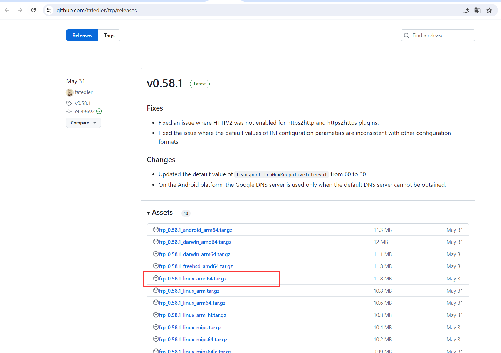
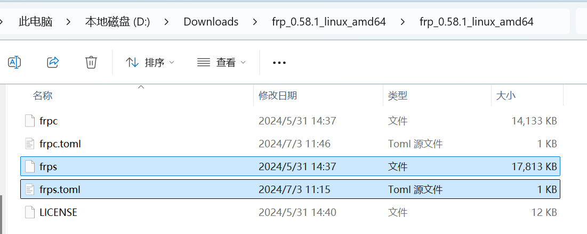
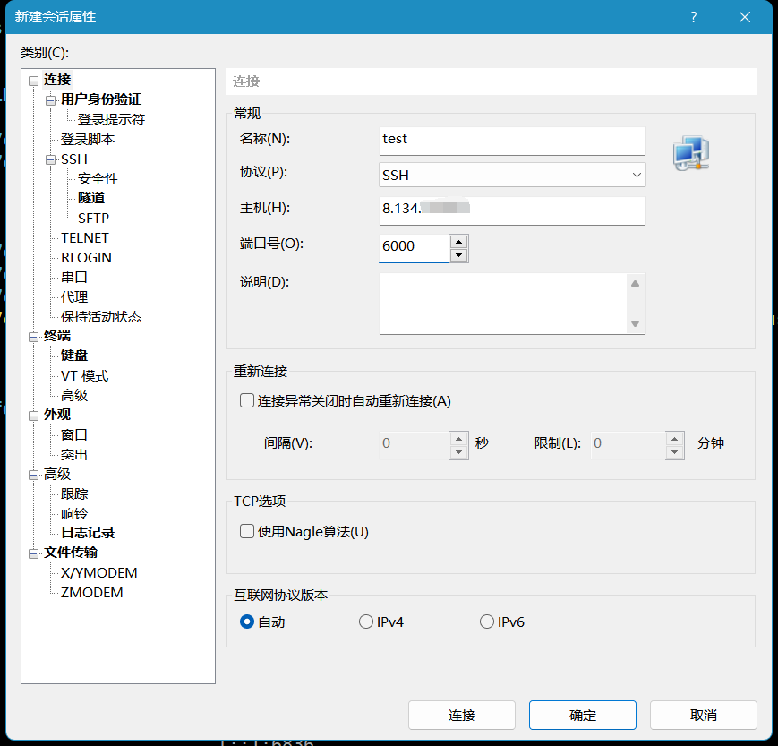
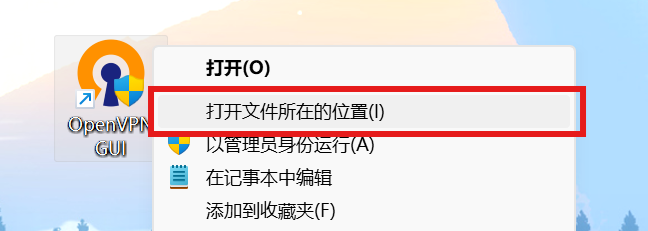
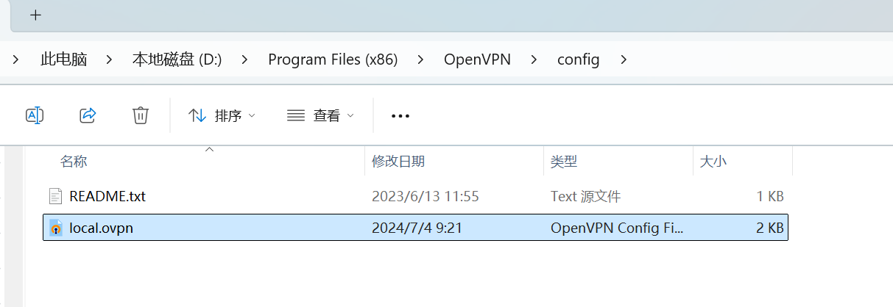
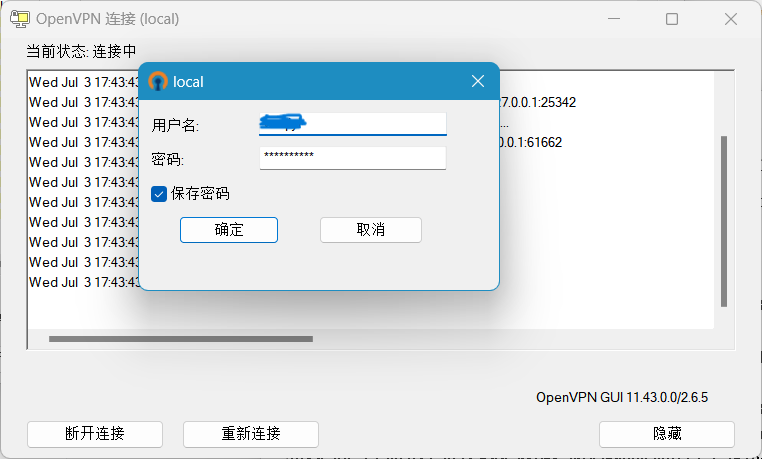
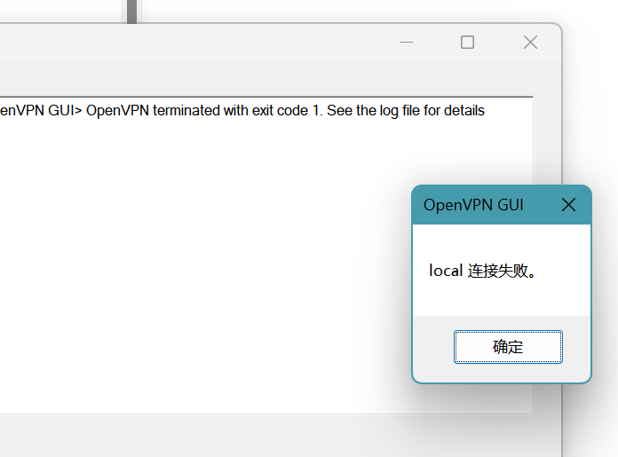
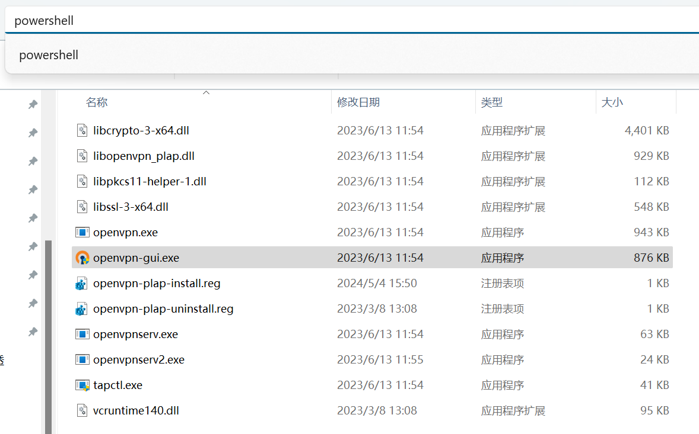
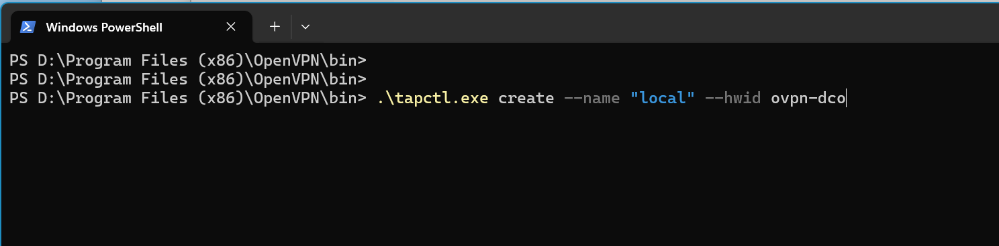

# frp + openvpn 实现内网穿透


# 一、背景

有些朋友可能会在家里的服务器搭建Linux虚机测试环境，但是在公司上班时只能通过向日葵等远程工具连接到家里的Windows主机后再进行操作，无法直接访问到家里的Linux虚机以及服务，且可能有画质模糊、网络影响较大、文件传输繁琐等问题。

于是想到在家里部署openvpn服务器搭建虚拟专用网，但是想要在公司连接到这台openvpn服务器必须要有一个公网地址。尝试给运营商打电话，申请将家里的路由器桥接到公网，因为全球ipv4地址用尽，申请无果。

在网上搜索解决方案，最终采用frp内网穿透工具，原理是反向代理。

将一台搭建了frp服务端的公网服务器作为中转站，当我们在公司访问这台frp服务器时，它会将请求转发至家里的frp客户端服务器中，然后我们在这台frp客户端服务器中搭建openvpn，实现对内网环境所有主机的访问。


# 二、frp内网穿透实现步骤

## 1、在公网服务器启动frp服务端

### 1.1 获取阿里云服务器试用

本次演示采用免费使用的阿里云服务器，首先登录阿里云官网，点击产品 --> 开始免费试用。


选择 “云服务器ECS” ，由于我是完成后截的图，所以这里是显示已试用。然后配置好相应的参数，**镜像选择 centos 7** ，然后开通实例即可。（这里由于我点不进去了，就不截图了）


### 1.2 部署frp服务端

参考链接：https://www.cnblogs.com/cenima/p/17849921.html

frp工具下载地址：https://github.com/fatedier/frp/releases




下载并解压后，目录内有如下文件，frps及frps.toml为服务端所需文件，frpc及frpc.toml为客户端所需文件。

现在将frps及frps.toml上传至刚才开通的公网服务器上。




```shell
# 1、将frps及frps.toml放至同一目录下，这里以/root/frp为例
mkdir /root/frp
cd /root/frp

# 2、修改配置文件
cat > /root/frp/frps.toml << 'EOF'
bindPort = 6060				# frp服务端进程监听端口，frp客户端通过此端口与服务端通信
transport.tls.force = true		# 服务端将只接受 TLS 连接
auth.token = "mytoken" 			# 鉴权密码，可自定义
EOF

# 3、启动frp服务端
chmod +x /root/frp/frps
nohup /root/frp/frps -c /root/frp/frps.toml >> /root/frp/logs 2>&1 &

# 4、查看是否正常启动
ps -ef | grep frps | grep -v grep
cat /root/frp/frps/logs

# 5、设为开机自启
echo 'nohup /root/frp/frps -c /root/frp/frps.toml >> /root/frp/logs 2>&1 &' >> /etc/rc.local
chmod +x /etc/rc.local
```


## 2、在内网服务器启动frp客户端

上传frpc及frpc.toml到家里的一台Linux服务器上，该服务器后续也将作为openvpn服务器，**本次实验使用的Linux服务器均为CentOS 7操作系统，建议家里所有虚机都使用桥接模式，NAT模式可能会比较麻烦，暂未测试**。

```shell
# 1、将frpc及frpc.toml上传至同一目录下，这里以/root/frp为例
mkdir /root/frp
cd /root/frp

# 2、修改配置文件
cat > /root/frp/frpc.toml << 'EOF'
serverAddr = "8.134.xx.xx"    # 需要连接到的公网服务器IP地址
serverPort = 6060			  # 公网服务器上的frp服务端监听的端口号
auth.token = "mytoken" 			# 身份验证令牌，frpc要与frps一致

# 代理配置
[[proxies]]
name = "ssh"			# 需要转发到的服务名，可自定义
type = "tcp"			# 网络协议
localIP = "127.0.0.1"	# 需要转发到的ip地址
localPort = 22			# 本地服务端口号，这里以ssh服务的端口为例
remotePort = 6000		# 访问公网frp服务端的6000端口时，将转发到localIP的22端口
EOF

# 3、启动frp客户端
chmod +x /root/frp/frpc
nohup /root/frp/frpc -c /root/frp/frpc.toml >> /root/frp/logs 2>&1 &

# 4、查看是否正常启动
ps -ef | grep frpc | grep -v grep
tail -f logs

# 5、设为开机自启
echo 'nohup /root/frp/frpc -c /root/frp/frpc.toml >> /root/frp/logs 2>&1 &' >> /etc/rc.local
chmod +x /etc/rc.local
```


## 3、测试连接

### 3.1 放通端口

阿里云服务器需要放通安全策略，进入阿里云控制台，进入实例详情，点击安全组，管理规则。


点击手动添加，配置需要放通的策略，如下图所示，放通6060及6000端口的公网访问策略。


### 3.2 测试使用ssh连接

根据刚才frpc客户端的配置，我们尝试连接公网服务器的6000端口，相当于连接到家里的内网服务器的22端口。

如果能够登录上家里的内网服务器，则测试成功。




到这里，我们已经完成了frp内网穿透，如果你想要访问家里服务器的其他端口，可以再启动多个frpc客户端。

但是如果我们想要畅通无阻的访问家里的所有服务，而不是每个端口都需要手动配置代理，可以参考下面的OpenVPN部署。


# 三、OpenVPN 部署

在刚刚安装了 frpc 客户端的 CentOS 7 服务器上部署 OpenVPN，以实现内网所有主机的一次性内网穿透。
**注意：建议家里的所有虚拟机都使用桥接模式，NAT模式可能会比较麻烦，暂未测试。**

## 1、安装 OpenVPN

```shell
# 1. 配置 yum 仓库
curl https://mirrors.aliyun.com/repo/epel-7.repo -o /etc/yum.repos.d/epel.repo

yum clean all && yum makecache

# 2. 安装必备软件
# 安装 openvpn 和 easy-rsa
# easy-rsa 是 openvpn 官方提供的工具，可以用于快速生成 openvpn 所需要的证书
# openvpn-auth-ldap 提供了一个 so 文件以便让 openvpn 访问 openldap 实现鉴权
yum install openvpn easy-rsa openvpn-auth-ldap -y

```


## 2、生成 TLS 证书

```shell
# 1. 创建证书环境目录
mkdir -p /opt/easy-rsa
cp -a /usr/share/easy-rsa/3.0.8/* /opt/easy-rsa/
cd /opt/easy-rsa

cat > vars << EOF
set_var EASYRSA_DN              "cn_only"
set_var EASYRSA_REQ_COUNTRY     "CN"
set_var EASYRSA_REQ_PROVINCE    "Guangdong"
set_var EASYRSA_REQ_CITY        "Guangzhou"
set_var EASYRSA_REQ_ORG         "Mycompany"
set_var EASYRSA_REQ_EMAIL       "sglthr@mycompany.cn"
set_var EASYRSA_NS_SUPPORT      "yes"
EOF

alias er='./easyrsa'

# 2. 创建构建证书的工作目录
er init-pki

# 3. 创建CA证书，会提示要输入 Common Name，这里输入 Mycompany 就好
er build-ca nopass


# 4. 创建服务端证书，这里的 gd-server 是文件名，可以按需修改
# 创建服务端证书会需要填写 Common Name，依旧输入 Mycompany
er gen-req gz-server nopass

# 签名服务端证书，把 gd-server改为第 4 步创建服务端证书的文件名
# 这里要求输入 yes 确认之前输入的信息没有问题
er sign-req server gz-server

# 5. 创建 dh 证书
er gen-dh

# 6. 创建客户端证书，输入 Mycompany
er gen-req gz-client nopass

# 签名客户端证书，输入 yes
er sign-req client gz-client

# 7. 复制 openvpn 服务端所需要的文件
cd pki

cp ca.crt dh.pem issued/gz-server.crt private/gz-server.key /etc/openvpn/server

# 配置权限
chown -R openvpn:openvpn /etc/openvpn

# 8. 保留 ca.crt 文件内容，作为客户端连接的证书
cat ca.crt

<ca>
-----BEGIN CERTIFICATE-----
MIIDKDCCAhCgAwIBAgIJAJYBiZ7gPlunMA0GCSqGSIb3DQEBCwUAMBIxEDAOBgNV
BAMMB1plcjBkYXkwHhcNMjQwNjMwMDc1MDU2WhcNMzQwNjI4MDc1MDU2WjASMRAw
DgYDVQQDDAdaZXIwZS<---   示例文件   --->BAQEFAAOCAQ8AMIIBCgKCAQEA
zsAqD4c09Sy35xnsijbdN9RI/XI5njERLw8YqcxgIc6UOH4gwoZx9XNzc176tJVn
fYZgZay5fuzbG4Awr4Z0ReCZ6vq8Jm3MffE0y4WtUYpredefcDq1eFefdV+4TlGX
vJvOU0zMZeCqdwpEqO4LB3Qkz6ENq8Kqps/51RcT3aaVjObY9OjN41QwFuYyaFwH
uSGuOcBCqkS780kY68<---   示例文件   --->CIrP9rpN8XpA2OYNeLd+H/jcZ
o2xAtjgJu+pIi22qvIzWIQIDAQABo4GAMH4wHQYDVR0OBBYEFFWK5TJYQwdAadt3
y45+A0dZZfQsMEIGA1UdIwQ7MDmAFFWK5TJYQwdAadt3y45+A0dZZfQsoRakFDAS
MRAwDgYDVQQDDAdaZXIwZGF5ggkAlgGJnuA+W6cwDAYDVR0TBAUwAwEB/zALBgNV
HQ8EBAMCAQYwDQYJgdK<---   示例文件   --->7aY/RaKdLdgnUmJGMtz8UdPn
cpI+lt/uRXHIOkh9q916oAaPwubg8JziMJPJSr6hdgY50sSO6QjFThAw0OZG4gAb
535sKeBoa8KnrVf5OT1aDlzhTb4C5zvTBWH5o6BDVKVZONK9QnSudEuWqpRGEdyB
RsNAF6psIR8vzgEz3agCOTJRvPdwwxlOGj78V1By/v3VTv48G5Fyzm+8WaAXLx3C
YXnPi3dK0ZsJM7LoqeEjPoBWWZCvYGgtjrS3BldvpMS/fkR9EocjiP92y/c=
-----END CERTIFICATE-----
</ca>
```


## 3、创建 OpenVPN 服务端配置

```shell
cat > /etc/openvpn/server/server.conf <<EOF
# openvpn 监听端口
port 1194
# openvpn 监听协议
proto tcp
# 使用隧道，三层转发
dev tun
# 证书相关配置
ca ca.crt
cert gz-server.crt
key gz-server.key
dh dh.pem
verify-client-cert optional
# 注意1：不能和VPN服务器内网网段有相同；
# 注意2：如果 openvpn 客户端有同时连接多个区域的需求，那么多个区域的 openvpn 配置文件的 server 的网段不能有冲突，比如广州公司的 openvpn 网段是 10.20.0.0，深圳公司的是10.100.0.0
server 10.60.0.0 255.255.0.0
# 允许客户端访问的网段，这里修改为openvpn服务器的桥接网段
push "route 192.168.101.0 255.255.255.0"
# 存活检测，10秒ping一次,120 如未收到响应则视为断线
keepalive 10 120 
# 最多允许200个客户端连接
max-clients 200 
# 记录登录用户的日志
status openvpn-status.log 
# 日志输出级别
verb 3
# 客户端与客户端之间支持通信
client-to-client 
#openvpn日志记录位置
log openvpn.log 
persist-key
persist-tun
duplicate-cn
# 允许使用自定义脚本
script-security 3
# 用户密码登陆方式验证  
auth-user-pass-verify /etc/openvpn/server/check.sh via-env
username-as-common-name         
user  openvpn
group openvpn
EOF

```


## 4、创建鉴权脚本

```shell
cat > /etc/openvpn/server/check.sh <<"EOF" 
#!/bin/sh
###########################################################
PASSFILE="/etc/openvpn/server/openvpnfile"
LOG_FILE="/var/log/openvpn-password.log"
TIME_STAMP=`date "+%Y-%m-%d %T"`

if [ ! -r "${PASSFILE}" ]; then
    echo "${TIME_STAMP}: Could not open password file \"${PASSFILE}\" for reading." >> ${LOG_FILE}
    exit 1
fi

CORRECT_PASSWORD=`awk '!/^;/&&!/^#/&&$1=="'${username}'"{print $2;exit}' ${PASSFILE}`

if [ "${CORRECT_PASSWORD}" = "" ]; then
    echo "${TIME_STAMP}: User does not exist: username=\"${username}\", password=\"${password}\"." >> ${LOG_FILE}
    exit 1
fi
if [ "${password}" = "${CORRECT_PASSWORD}" ]; then
    echo "${TIME_STAMP}: Successful authentication: username=\"${username}\"." >> ${LOG_FILE}
    exit 0
fi

echo "${TIME_STAMP}: Incorrect password: username=\"${username}\", password=\"${password}\"." >> ${LOG_FILE}
exit 1
EOF

# 创建登录 OpenVPN 账号密码文件，后续将用该文件中定义的账号密码登录VPN
cat > /etc/openvpn/server/openvpnfile <<EOF 
zhangsan ZhangSan666
lisi LiSi777
EOF

# 添加鉴权脚本执行权限
chmod +x /etc/openvpn/server/check.sh

# 重新配置下权限
chown -R openvpn:openvpn /etc/openvpn/server

# 重启 OpenVPN
systemctl restart openvpn-server@server 
systemctl enable openvpn-server@server --now
```


## 5、防火墙配置

```shell
systemctl enable firewalld --now
firewall-cmd --add-masquerade
firewall-cmd --add-port=1194/tcp
firewall-cmd --runtime-to-permanent

# ------  拓展，以下仅作学习记录，不用操作  ------
# 删除策略
firewall-cmd --remove-source=10.60.0.0/24 --permanent
```


## 6、测试连接
### 6.1 修改frpc配置文件
将frpc客户端代理端口（localPort）修改为 OpenVPN 服务的端口

```shell
# 1、修改frpc配置文件
cat > /root/frp/frpc.toml << 'EOF'
serverAddr = "8.134.xx.xx"     # 需要连接到的公网服务器IP地址
serverPort = 6060               # 公网服务器上的frp服务端监听的端口号
auth.token = "mytoken"           # 身份验证令牌，frpc要与frps一致

# 代理配置
[[proxies]]
name = "openvpn"               # 需要转发到的服务名，可自定义
type = "tcp"                    # 网络协议
localIP = "127.0.0.1"           # 需要转发到的ip地址
localPort = 1194               # 将该端口设置为本机的OpenVPN服务端口号
remotePort = 1194              # 访问frp服务端的1194端口时，将转发到localIP的1194端口
EOF

# 2、重启frpc
ps -ef | grep frpc | grep -v grep | awk '{print $2}' | xargs kill -9
nohup /root/frp/frpc -c /root/frp/frpc.toml >> /root/frp/logs 2>&1 &
```

**然后到阿里云添加安全策略，允许访问1194端口。**

### 6.2 测试openvpn连接

测试：使用公司工作电脑连接家里的OpenVPN服务器。Windows版的openvpn客户端安装包已放至当前目录下，文件名为 `OpenVPN-2.6.5-I001-amd64.msi` ，请自行安装。

安装后，在桌面找到OpenVPN的图标，打开 OpenVPN 的安装位置。




返回上一层目录，然后进入config目录，在该目录下创建名为 `local.ovpn` 的openvpn客户端配置文件，如下图所示。




以下为 `local.ovpn` 文件内容，对其进行修改并保存。
```ini
client
dev tun
proto tcp
# 修改成你的阿里云服务器公网ip
remote 8.134.xx.xx 1194
resolv-retry infinite 
nobind
verb 3
persist-key 
persist-tun
remote-cert-tls server
auth-user-pass
# 将之前创建的ca.crt内容粘贴到这里，不要漏掉了<ca>和</ca>
<ca>
-----BEGIN CERTIFICATE-----
MIIDKDCCAhCgAwIBAgIJAJYBiZ7gPlunMA0GCSqGSIb3DQEBCwUAMBIxEDAOBgNV
BAMMB1plcjBkYXkwHhcNMjQwNjMwMDc1MDU2WhcNMzQwNjI4MDc1MDU2WjASMRAw
DgYDVQQDDAdaZXIwZS<---   示例文件   --->BAQEFAAOCAQ8AMIIBCgKCAQEA
zsAqD4c09Sy35xnsijbdN9RI/XI5njERLw8YqcxgIc6UOH4gwoZx9XNzc176tJVn
fYZgZay5fuzbG4Awr4Z0ReCZ6vq8Jm3MffE0y4WtUYpredefcDq1eFefdV+4TlGX
vJvOU0zMZeCqdwpEqO4LB3Qkz6ENq8Kqps/51RcT3aaVjObY9OjN41QwFuYyaFwH
uSGuOcBCqkS780kY68<---   示例文件   --->CIrP9rpN8XpA2OYNeLd+H/jcZ
o2xAtjgJu+pIi22qvIzWIQIDAQABo4GAMH4wHQYDVR0OBBYEFFWK5TJYQwdAadt3
y45+A0dZZfQsMEIGA1UdIwQ7MDmAFFWK5TJYQwdAadt3y45+A0dZZfQsoRakFDAS
MRAwDgYDVQQDDAdaZXIwZGF5ggkAlgGJnuA+W6cwDAYDVR0TBAUwAwEB/zALBgNV
HQ8EBAMCAQYwDQYJgdK<---   示例文件   --->7aY/RaKdLdgnUmJGMtz8UdPn
cpI+lt/uRXHIOkh9q916oAaPwubg8JziMJPJSr6hdgY50sSO6QjFThAw0OZG4gAb
535sKeBoa8KnrVf5OT1aDlzhTb4C5zvTBWH5o6BDVKVZONK9QnSudEuWqpRGEdyB
RsNAF6psIR8vzgEz3agCOTJRvPdwwxlOGj78V1By/v3VTv48G5Fyzm+8WaAXLx3C
YXnPi3dK0ZsJM7LoqeEjPoBWWZCvYGgtjrS3BldvpMS/fkR9EocjiP92y/c=
-----END CERTIFICATE-----
</ca>
```

双击启动桌面上的 OpenVPN 客户端，输入之前定义好的账号密码，zhangsan/ZhangSan666，点击确定，测试连接。



连接成功，over ~~ 如果连接失败，可以到第四章找找是否有你想要的答案。
感谢看到这里的朋友，欢迎提问或者提出修改建议！

	


# 四、问题记录

## 1、客户端登录OpenVPN成功，但是无法ssh连接OpenVPN服务器以及另外几台内网服务器？

尝试将openvpn服务器的22端口代理到公网，然后重启openvpn服务器的sshd，问题解决。

```shell
# 在openvpn服务器上操作
# 1、创建frp目录副本
cp -a /root/frp/ /root/frp-1
cd /root/frp-1/

# 2、修改frpc配置文件
cat > /root/frp-1/frpc.toml << 'EOF'
serverAddr = "8.134.xx.xx"     # 需要连接到的公网服务器IP地址
serverPort = 6060               # 公网服务器上的frp服务端监听的端口号
auth.token = "mytoken"           # 身份验证令牌，frpc要与frps一致

# 代理配置
[[proxies]]
name = "test-ssh"               # 需要转发到的服务名，可自定义
type = "tcp"                    # 网络协议
localIP = "127.0.0.1"           # 需要转发到的ip地址
localPort = 22               # 将该端口设置为本机的ssh服务端口号
remotePort = 6000              # 访问frp服务端的6000端口时，将转发到localIP的22端口
EOF

# 3、启动frpc副本
nohup /root/frp-1/frpc -c /root/frp-1/frpc.toml >> /root/frp-1/logs 2>&1 &

# 查看是否启动成功
ps -ef | grep frp | grep -v grep

# 4、重启sshd，然后测试连接
systemctl restart sshd

# 5、关闭刚刚启动的frpc副本，再次测试，发现仍然能连接成功，所以不确定是不是只需要重启sshd即可
ps -ef | grep frp-1 | grep -v grep | awk '{print $2}' | xargs kill -9
```

## 2、最后一步测试连接 OpenVPN 服务器失败？
问题如图：



有些朋友可能之前有安装过OpenVPN，也成功连接过其他地方的OpenVPN。但是每连接一个OpenVPN就需要占用一张虚拟网卡，而安装OpenVPN时默认只会创建一张虚拟网卡，如果想要连接多个OpenVPN，就需要手动创建虚拟网卡。步骤如下：
(1) 打开OpenVPN安装目录


(2) 在地址栏输入 powershell 并回车




(3) 在打开的powershell中输入以下命令，创建名为 local 的虚拟网卡：

```
.\tapctl.exe create --name "local" --hwid ovpn-dco
```



```shell
# 查看虚拟网卡
.\openvpn.exe --show-adapters

# ----- 拓展，以下命令仅作学习记录，不用执行 -----
# 删除虚拟网卡，如果不生效就去设备管理器删。
.\tapctl.exe delete --name "网卡名"
```

最后再次连接OpenVPN即可。