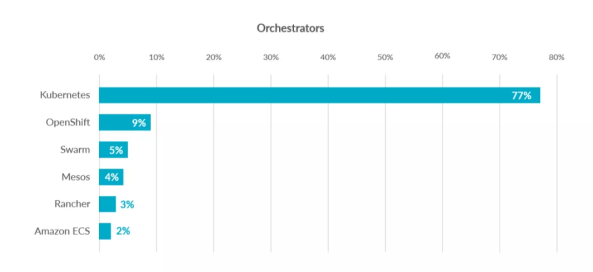
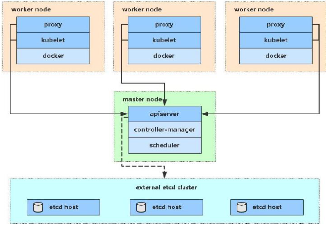

# Kubernetes 集群部署入门文档（2023.8）


# 1. Kubernetes介绍

## 1.1 应用部署方式演变

在部署应用程序的方式上，主要经历了三个时代：

- **传统部署**：互联网早期，会直接将应用程序部署在物理机上

  > 优点：简单，不需要其它技术的参与
  >
  > 缺点：不能为应用程序定义资源使用边界，很难合理地分配计算资源，而且程序之间容易产生影响

- **虚拟化部署**：可以在一台物理机上运行多个虚拟机，每个虚拟机都是独立的一个环境

  > 优点：程序环境不会相互产生影响，提供了一定程度的安全性
  >
  > 缺点：增加了操作系统，浪费了部分资源

- **容器化部署**：与虚拟化类似，但是共享了操作系统

  > 优点：
  >
  > 可以保证每个容器拥有自己的文件系统、CPU、内存、进程空间等
  >
  > 运行应用程序所需要的资源都被容器包装，并和底层基础架构解耦
  >
  > 容器化的应用程序可以跨云服务商、跨Linux操作系统发行版进行部署


容器化部署方式给带来很多的便利，但是也会出现一些问题，比如说：

- 一个容器故障停机了，怎么样让另外一个容器立刻启动去替补停机的容器
- 当并发访问量变大的时候，怎么样做到横向扩展容器数量

这些容器管理的问题统称为**容器编排**问题，为了解决这些容器编排问题，就产生了一些容器编排的软件：

- **Swarm**：Docker自己的容器编排工具
- **Mesos**：Apache的一个资源统一管控的工具，需要和Marathon结合使用
- **Kubernetes**：Google开源的的容器编排工具



## 1.2 kubernetes简介


 

kubernetes，是一个全新的基于容器技术的分布式架构领先方案，是谷歌严格保密十几年的秘密武器----Borg系统的一个开源版本，于2014年9月发布第一个版本，2015年7月发布第一个正式版本。

kubernetes的本质是**一组服务器集群**，它可以在集群的每个节点上运行特定的程序，来对节点中的容器进行管理。目的是实现资源管理的自动化，主要提供了如下的主要功能：

- **自我修复**：一旦某一个容器崩溃，能够在1秒中左右迅速启动新的容器
- **弹性伸缩**：可以根据需要，自动对集群中正在运行的容器数量进行调整
- **服务发现**：服务可以通过自动发现的形式找到它所依赖的服务
- **负载均衡**：如果一个服务起动了多个容器，能够自动实现请求的负载均衡
- **版本回退**：如果发现新发布的程序版本有问题，可以立即回退到原来的版本
- **存储编排**：可以根据容器自身的需求自动创建存储卷

## 1.3 kubernetes组件

一个kubernetes集群主要是由**控制节点(master)**、**工作节点(node)**构成，每个节点上都会安装不同的组件。

**master：集群的控制平面，负责集群的决策 ( 管理 )**

> **ApiServer** : 资源操作的唯一入口，接收用户输入的命令，提供认证、授权、API注册和发现等机制
>
> **Scheduler** : 负责集群资源调度，按照预定的调度策略将Pod调度到相应的node节点上
>
> **ControllerManager** : 负责维护集群的状态，比如程序部署安排、故障检测、自动扩展、滚动更新等
>
> **Etcd** ：负责存储集群中各种资源对象的信息

**node：集群的数据平面，负责为容器提供运行环境 ( 干活 )**

> **Kubelet** : 负责维护容器的生命周期，即通过控制docker，来创建、更新、销毁容器
>
> **KubeProxy** : 负责提供集群内部的服务发现和负载均衡
>
> **Docker** : 负责节点上容器的各种操作


下面，以部署一个nginx服务来说明kubernetes系统各个组件调用关系：

1. 首先要明确，一旦kubernetes环境启动之后，master和node都会将自身的信息存储到etcd数据库中

2. 一个nginx服务的安装请求会首先被发送到master节点的apiServer组件

3. apiServer组件会调用scheduler组件来决定到底应该把这个服务安装到哪个node节点上

   在此时，它会从etcd中读取各个node节点的信息，然后按照一定的算法进行选择，并将结果告知apiServer

4. apiServer调用controller-manager去调度Node节点安装nginx服务

5. kubelet接收到指令后，会通知docker，然后由docker来启动一个nginx的pod

   pod是kubernetes的最小操作单元，容器必须跑在pod中至此，

6. 一个nginx服务就运行了，如果需要访问nginx，就需要通过kube-proxy来对pod产生访问的代理

这样，外界用户就可以访问集群中的nginx服务了

## 1.4 kubernetes概念

**Master**：集群控制节点，每个集群需要至少一个master节点负责集群的管控

**Node**：工作负载节点，由master分配容器到这些node工作节点上，然后node节点上的docker负责容器的运行

**Pod**：kubernetes的最小控制单元，容器都是运行在pod中的，一个pod中可以有1个或者多个容器

**Controller**：控制器，通过它来实现对pod的管理，比如启动pod、停止pod、伸缩pod的数量等等

**Service**：pod对外服务的统一入口，下面可以维护者同一类的多个pod

**Label**：标签，用于对pod进行分类，同一类pod会拥有相同的标签

**NameSpace**：命名空间，用来隔离pod的运行环境


# 2. kubernetes集群环境搭建

## 2.1 前置知识点

目前生产部署Kubernetes 集群主要有两种方式：

**kubeadm**

Kubeadm 是一个K8s 部署工具，提供kubeadm init 和kubeadm join，用于快速部署Kubernetes 集群。

官方地址：https://kubernetes.io/docs/reference/setup-tools/kubeadm/kubeadm/

**二进制包**

从github 下载发行版的二进制包，手动部署每个组件，组成Kubernetes 集群。

Kubeadm 降低部署门槛，但屏蔽了很多细节，遇到问题很难排查。如果想更容易可控，推荐使用二进制包部署Kubernetes 集群，虽然手动部署麻烦点，期间可以学习很多工作原理，也利于后期维护。


## 2.2 kubeadm 部署方式介绍

kubeadm 是官方社区推出的一个用于快速部署kubernetes 集群的工具，这个工具能通过两条指令完成一个kubernetes 集群的部署：

- 创建一个Master 节点（kubeadm init）
- 将Node 节点加入到当前集群中（ kubeadm join <Master 节点的IP 和端口>）

## 2.3 环境准备

本次k8s集群部署所使用的主机环境和版本说明：

- 三台虚拟机，操作系统为 CentOS 7.6 （要求 7.5 以上版本）
- k8s 版本为 1.23.8 ，Docker 版本为 20.10.24

 



| 节点   | IP地址          | 组件                              |
| :----- | :-------------- | :-------------------------------- |
| master | 192.168.109.132 | docker，kubectl，kubeadm，kubelet |
| node1  | 192.168.109.133 | docker，kubectl，kubeadm，kubelet |
| node2  | 192.168.109.134 | docker，kubectl，kubeadm，kubelet |

## 2.4 系统初始化（三个节点都要操作）

**建议新手使用刚安装好的虚拟机进行以下实验学习，否则可能遇到许多难以解决的问题！！！**

### 2.4.1 设置系统主机名以及 Host 文件的相互解析

```shell
# 分别设置三台主机的主机名（以下三条命令，每台主机一条！）

# 设置 mater 节点主机名
hostnamectl set-hostname master 

# 设置 node1 节点主机名
hostnamectl set-hostname node1

# 设置 node2 节点主机名
hostnamectl set-hostname node2 

# 设置完成后不会立即生效，等我们稍后完成所有配置再重启生效
```

**以下配置文件在三个节点都要配置，ip需要自行修改！！！**

```shell
# 配置ip映射文件，在/etc/hosts文件后面加入三个节点的Ip和主机名
# 这里的ip不能照抄！！！根据自己的三台主机ip修改以下三个ip
cat <<EOF >> /etc/hosts
192.168.109.132     master
192.168.109.133     node1
192.168.109.134     node2
# vip 虚拟地址，keepalived需要用到
# 设置为和master节点同网段的随便一个不存在主机的地址即可，例如我的就是192.168.109.××
192.168.109.168     vip  
EOF
```


### 2.4.2 配置 yum 源并安装必要的依赖

```shell
# 配置基础源
curl -o /etc/yum.repos.d/CentOS-Base.repo https://mirrors.aliyun.com/repo/Centos-7.repo

curl -o /etc/yum.repos.d/epel.repo https://mirrors.aliyun.com/repo/epel-7.repo

# 修改为阿里云的镜像地址
sed -i -e '/mirrors.cloud.aliyuncs.com/d' -e '/mirrors.aliyuncs.com/d' /etc/yum.repos.d/CentOS-Base.repo

sed -i 's|^#baseurl=https://download.example/pub|baseurl=https://mirrors.aliyun.com|' /etc/yum.repos.d/epel*

sed -i 's|^metalink|#metalink|' /etc/yum.repos.d/epel*

# 清除并重建 yum 索引缓存
yum clean all && yum makecache

# 安装必要的依赖
yum install -y device-mapper-persistent-data lvm2 yum-utils 

# 配置阿里云的 docker yum源
yum-config-manager --add-repo https://mirrors.aliyun.com/docker-ce/linux/centos/docker-ce.repo

# 将文件中的 download.docker.com 替换为 mirrors.aliyun.com/docker-ce
sed -i 's+download.docker.com+mirrors.aliyun.com/docker-ce+' /etc/yum.repos.d/docker-ce.repo

# 配置下载 k8s 三大组件的阿里云 yum 源
cat <<EOF > /etc/yum.repos.d/kubernetes.repo
[kubernetes]
name=Kubernetes
baseurl=https://mirrors.aliyun.com/kubernetes/yum/repos/kubernetes-el7-x86_64/
enabled=1
gpgcheck=1
repo_gpgcheck=1
gpgkey=https://mirrors.aliyun.com/kubernetes/yum/doc/yum-key.gpg https://mirrors.aliyun.com/kubernetes/yum/doc/rpm-package-key.gpg
EOF

# 清除并重建 yum 索引缓存
yum clean all && yum makecache

```


### 2.4.3 升级操作系统内核

由于 3.x 版本的系统内核有较多bug，例如 3.x 版本的内核存在内存泄漏的问题，导致内存无法回收，只有重启主机才能解决，而**实际生产环境是不能随便重启主机的**，因此需要升级内核。

```shell
# 查看当前内核版本
uname -smr

# 启用 ELRepo 仓库，这个仓库可以下载内核的 rpm
rpm --import https://www.elrepo.org/RPM-GPG-KEY-elrepo.org

rpm -Uvh http://www.elrepo.org/elrepo-release-7.0-3.el7.elrepo.noarch.rpm 

# 查看可用内核
yum --disablerepo="*" --enablerepo="elrepo-kernel" list available

# 选择 kernel-lt 版本的内核安装， lt 是长期支持版本 （安装很慢，耐心等待）
yum --enablerepo="elrepo-kernel" install -y kernel-lt 

# 设置开机默认选择新版内核
sed -i 's/GRUB_DEFAULT=saved/GRUB_DEFAULT=0/' /etc/default/grub

# 查看修改是否生效，即是否设置为 GRUB_DEFAULT=0
cat /etc/default/grub

# 执行如下命令重新生成内核配置文件
grub2-mkconfig -o /boot/grub2/grub.cfg

grub2-set-default 0

# 执行 reboot 重启主机
reboot

# 验证当前启动时所使用的内核版本
uname -smr 

```


### 2.4.4 配置系统内核参数和 ipvs

**以下配置照搬即可，无需修改**

```shell
# 内核模块配置，允许 iptables 检查桥接网络的流量（bridged traffic）
tee /etc/modules-load.d/k8s.conf <<EOF
overlay
br_netfilter
EOF

# sysctl 参数配置
tee /etc/sysctl.conf <<EOF
net.bridge.bridge-nf-call-ip6tables = 1
net.bridge.bridge-nf-call-iptables  = 1
net.ipv4.ip_forward                 = 1
net.ipv6.conf.all.disable_ipv6      = 0
net.ipv6.conf.default.disable_ipv6  = 0
net.ipv6.conf.lo.disable_ipv6       = 0
net.ipv6.conf.all.forwarding        = 1
net.netfilter.nf_conntrack_max      = 1000000
vm.swappiness                       = 0
vm.panic_on_oom                     = 0
vm.max_map_count                    = 524288
fs.inotify.max_user_instances       = 81920
EOF

# 安装 ipset 和 ipvsadmin
yum install -y ipset ipvsadm

# 添加配置文件
cat <<EOF > /etc/modules-load.d/k8s-ipvs.conf
ip_vs
ip_vs_rr
ip_vs_wrr
ip_vs_sh
nf_conntrack
EOF

# 重启加载内核模块的服务
systemctl restart systemd-modules-load.service

# 手动加载所有配置文件
sysctl --system

# 检查内核模块是否加载
lsmod | grep -e ip_vs -e nf_conntrack

# 配置 limits 文件
tee /etc/security/limits.d/k8s.conf <<EOF
* soft nofile 65536 
* hard nofile 65536 
* soft nproc  65536 
* soft nproc  65536
EOF

```


### 2.4.5 时间同步

对于公网主机的时间同步可以参考以下链接

https://developer.aliyun.com/mirror/NTP?spm=a2c6h.13651102.0.0.25251b1146gHIB

```shell
# 立即启用时间同步服务并设置为开机自启
systemctl enable --now chronyd

# 查看并验证当前系统时间
date

```


### 2.4.6 关闭交换分区，禁用防火墙和 selinux

```shell
# 立即关闭交换分区（临时）
swapoff -a

# 修改配置文件，取消开机自动配置交换分区
sed -i 's/^.*swap/#&/g' /etc/fstab

# 关闭防火墙开机自启（--now 立即关闭）
systemctl disable firewalld --now

# 修改配置文件，取消 selinux 开机自启
sed -i 's/^SELINUX=enforcing$/SELINUX=disabled/' /etc/selinux/config

```


### 2.4.7 重启系统，读取配置

```shell
# 重启系统，读取配置并检验
reboot

# 查看防火墙是否关闭
systemctl status firewalld

# 检查 selinux 是否关闭
getenforce

# 检查交换分区是否关闭
free -h
```


### 2.4.8 安装 Docker

K8S 集群内的每个节点都需要一个容器运行时（container runtime）来运行 Pod。

需要注意的是从 1.24 版本开始 K8S 不再支持 Docker 作为容器运行时，因此如果要升级 K8S 到 1.24 或者以上的版本需要先将容器运行时切换为非 Docker 的容器运行时。

本节描述如何安装 Docker 作为容器运行时，并设置 Docker 的相关配置。

```shell
# 1.23.8 的 k8s 对 Docker 的版本要求是不超过 20.10
yum install -y docker-ce-20.10.24 docker-ce-cli-20.10.24 

# 创建相关目录
mkdir -p /etc/docker

# 创建 Docker 配置文件
cat <<EOF >  /etc/docker/daemon.json  
{
    "registry-mirrors": ["https://docker.m.daocloud.io"],
    "exec-opts": [
        "native.cgroupdriver=systemd"
    ],
    "log-driver": "json-file",
    "log-opts": {
        "max-size": "500m",
        "max-file": "3"
    },
    "storage-driver": "overlay2",
    "storage-opts": [
        "overlay2.override_kernel_check=true"
    ],
    "insecure-registries": []
}
EOF

# 重新读取配置文件
systemctl daemon-reload

# 重启docker
systemctl restart docker

# 查看docker状态
systemctl status docker

# 设置开机自启
systemctl enable docker

# 验证docker版本
docker version
```


### 2.4.9 安装 kubernetes 组件

```shell
yum install -y kubeadm-1.23.8 kubelet-1.23.8 kubectl-1.23.8 

# 将 kubelet 设置为自启动
systemctl enable --now kubelet
```


## 2.5 创建集群 （仅在Master节点操作）

**系统初始化步骤需要在所有节点操作，而创建集群仅需在Master节点操作！！！**


### 2.5.1 创建集群所需配置文件

以下配置文件中的 serviceSubnet 和 podSubnet 配置项的设置要求：

- 网段要足够大，才能承载较多容器；
- 必须设置为内网网段地址，且这两个网段不能相互覆盖，否则容易引起混乱。

```shell
cat <<EOF > kubeadm-config.yaml
# 集群配置信息
apiVersion: kubeadm.k8s.io/v1beta2
kind: ClusterConfiguration
imageRepository: registry.cn-hangzhou.aliyuncs.com/google_containers
kubernetesVersion: 1.23.8
controlPlaneEndpoint: vip:16443
networking:
# 可以参考以下配置
  serviceSubnet: 10.96.0.0/12
  podSubnet: 172.168.0.0/16
---
# kubelet 配置信息
apiVersion: kubelet.config.k8s.io/v1beta1
kind: KubeletConfiguration
cgroupDriver: systemd
maxPods: 240
serializeImagePulls: false
---
# kube-proxy 配置，使用 ipvs
apiVersion: kubeproxy.config.k8s.io/v1alpha1
kind: KubeProxyConfiguration
mode: ipvs
EOF

# 拉取配置文件镜像
kubeadm config images pull --config kubeadm-config.yaml

```


### 2.5.2 创建 Keepalived 和 Nginx 的配置文件和静态 Pod yaml

**创建 Keepalived 配置文件**

**Keepalived 配置文件的变量说明（新手稍微了解一下即可，本次部署仅需修改APISERVER_VIP）**

- ${STATE} 变量表示 keepalived 是主节点还是从节点，对 keepalived 而言，主节点需要配置 MASTER，从节点要配置为BACKUP，VIP 会分配到主节点上
- ${INTERFACE} 是虚拟IP要附加在哪个网卡上的网卡名，例如 vip 附加在 ens33 这个网卡上
- ${ROUTER_ID}  对使用同一个VIP的集群应该有相同的 virtual_router_id，同一个内网下这个配置的值必须唯一
- ${PRIORITY} 是主从节点的优先级，在这里的配置，主节点配置 PRIORITY 为101，从节点配置为100就可以满足 keepalived 检测失败时触发VIP漂移到其他节点（也就是主从切换）
- ${AUTH_PASS} 对使用同一个VIP的集群应该具有相同的认证密码
- ${APISERVER_VIP} VIP的值，keepalived 会使用这个值作为虚拟IP

```shell
# 因为本次集群部署只有一个 Master 节点，所以无需关心主从节点问题。
# 这里你只需修改VIP地址（和之前配置的ip映射文件上的vip地址保持一致）
export STATE=MASTER
export INTERFACE=ens33
export ROUTER_ID=10
export PRIORITY=101
export AUTH_PASS=k8s
export APISERVER_VIP=192.168.109.168/24

# 创建文件目录
mkdir -p /etc/keepalived 

# 写入 keepalived 配置文件
cat <<EOF > /etc/keepalived/keepalived.conf
# k8s-ha keepalive configuration
global_defs {
    router_id LVS_DEVEL
}

vrrp_script check_apiserver {
  script "/etc/keepalived/check_apiserver.sh"
  # 检测时间间隔/秒
  interval 3
  # 检测为失败时降低的权重
  weight -2
  # 检测失败以下次数才认定为失败
  fall 10
  # 检测到重新存活后恢复的权重
  rise 2
}

vrrp_instance VI_1 {
    # 标记这是主节点，对于从节点这个值要改为 BACKUP
    state ${STATE}
    
    # keepalived 要使用的网卡
    interface ${INTERFACE}

    # 当前 vip 使用的的唯一表示 id，同一套 vip 的配置这个 id 必须一致
    virtual_router_id ${ROUTER_ID}

    # 优先级，主节点的优先级比从节点的要高
    priority ${PRIORITY}

    authentication {
        # keepalived 的鉴权方式
        auth_type PASS
        # keepalived 的鉴权密码
        auth_pass ${AUTH_PASS}
    }

    virtual_ipaddress {
        # VIP 的地址
        ${APISERVER_VIP}
    }
    track_script {
        # keepalived 的检测脚本
        check_apiserver
    }
}
EOF

```

**创建 Keepalived 检测脚本（需要修改VIP地址）**

```shell
cat <<"EOF" > /etc/keepalived/check_apiserver.sh
#!/bin/sh
errorExit() {
    echo "*** $*" 1>&2
    exit 1
}
# 集群的VIP
APISERVER_VIP=192.168.109.168

# 集群端口，这个也是 负载均衡 要使用的端口
APISERVER_DEST_PORT=16443

# 先检查自身 api-server 是否正常，如果 api-server 访问异常
# 则 curl 的响应码为1，报错退出脚本，失败次数达到 keepalived 阈值后
# vip虚拟地址会跑到备用master节点上，实现高可用
curl --silent --max-time 2 --insecure https://localhost:${APISERVER_DEST_PORT}/ -o /dev/null || errorExit "Error GET https://localhost:${APISERVER_DEST_PORT}/"

# 如果 vip 地址在本机上，则检查负载均衡是否正常
# 如果负载均衡不正常，则说明本机负载均衡不正常，失败次数达到阈值后
# keepalived 切走。
if ip addr | grep -q ${APISERVER_VIP}; then
    curl --silent --max-time 2 --insecure https://${APISERVER_VIP}:${APISERVER_DEST_PORT}/ -o /dev/null || errorExit "Error GET https://${APISERVER_VIP}:${APISERVER_DEST_PORT}/"
fi
EOF

# 赋予脚本执行权限
chmod u+x /etc/keepalived/check_apiserver.sh

```

**创建 Keepalived 静态 Pod yaml（无需修改）**

```shell
cat <<EOF > /etc/kubernetes/manifests/keepalived.yaml
apiVersion: v1
kind: Pod
metadata:
  name: keepalived
  namespace: kube-system
spec:
  containers:
  - image: osixia/keepalived:2.0.20
    name: keepalived
    resources: {}
    securityContext:
      capabilities:
        add:
        - NET_ADMIN
        - NET_BROADCAST
        - NET_RAW
    volumeMounts:
    - mountPath: /usr/local/etc/keepalived/keepalived.conf
      name: config
    - mountPath: /etc/keepalived/check_apiserver.sh
      name: check
  hostNetwork: true
  volumes:
  - hostPath:
      path: /etc/keepalived/keepalived.conf
      type: File
    name: config
  - hostPath:
      path: /etc/keepalived/check_apiserver.sh
      type: File
    name: check
EOF
```

**创建 Nginx 静态 Pod yaml（无需修改）**

```shell
tee /etc/kubernetes/manifests/nginx.yaml <<EOF
apiVersion: v1
kind: Pod
metadata:
  name: nginx-loadblance
  namespace: kube-system
spec:
  containers:
  - image: nginx:1.24-alpine-slim
    name: nginx
    livenessProbe:
      failureThreshold: 8
      tcpSocket:
        host: localhost
        port: 16443
    volumeMounts:
    - mountPath: /etc/nginx/nginx.conf
      name: nginxconf
      readOnly: true
  hostNetwork: true
  volumes:
  - hostPath:
      path: /etc/nginx/nginx.conf
      type: FileOrCreate
    name: nginxconf
EOF

```

**创建 Nginx 配置文件（需要修改apiserver地址）**

```shell
# 创建目录
mkdir -p /etc/nginx 

# 创建配置文件
tee /etc/nginx/nginx.conf <<"EOF"
worker_processes 1;

events {
    worker_connections 2048;
}

stream {
    # kube-apiserver 后端服务器配置(你的Maser节点地址)
    upstream k8s-apiserver {
        server 192.168.109.132:6443;
    }
    
    # 日志格式配置
    log_format k8s_log '$remote_addr [$time_local] '
    '$protocol $status $bytes_sent $bytes_received '
    '$session_time';

    server {
        listen *:16443;
        # 如果主机有 ipv6 地址，可以取消下面这一行的注释
        # listen [::]:16443;
        proxy_connect_timeout 5s;
        # 设置心跳超时时间，注意这个配置对使用 kubectl exec 和 kubectl logs 命令不友好
        # 因为5秒内没有心跳就会自动断开 kubectl exec
        # 最好将 kubectl 的配置文件设置为使用 k8s apiserver 的实际地址
        proxy_timeout 5s;
        proxy_pass k8s-apiserver;
        # 日志配置
        access_log /var/log/kube-proxy-access.log k8s_log;
        error_log /var/log/kube-proxy-error.log;
    }
}
EOF
```


### 2.5.3 初始化集群

```shell
kubeadm init --config kubeadm-config.yaml --upload-certs -v 5
```

集群创建成功后会输出如下内容，里面包含了**集群节点加入所需的token**，可以先保存到文本文件上，用于后续节点的加入，**加入 Master 节点的命令有效期是2小时，加入 Worker 节点的命令有效期是 24小时。**


**首先你需要完成图中三条命令以开始集群的使用**

```shell
mkdir -p $HOME/.kube
sudo cp -i /etc/kubernetes/admin.conf $HOME/.kube/config
sudo chown $(id -u):$(id -g) $HOME/.kube/config

```


##  2.6 加入其余工作节点（在node节点操作）

```shell
# 复制你的集群创建完成之后的最底下那行命令，在你的node节点执行，即可加入集群成为Worker节点
kubeadm join vip:16443 --token 4hiiww.ksves900806xt4yc \
        --discovery-token-ca-cert-hash sha256:05802e4b07a370d52f0da4443a3e296b4b3b01d02c6e51b2c9238740193888a9 
        
# 在 Master 节点查看工作节点是否加入成功
kubectl get nodes
```


## 2.7 部署网络（在Master节点操作）


查看集群节点可以发现目前节点状态都为Not Ready，这是因为还没有安装**网络插件**，在完成网络插件的安装后集群状态会从 Not Ready 变为 Ready。

calico 版本与 K8S 必须要兼容，当前集群可以使用 3.23 版本的yaml。

```shell
# 获取 calico 的 yaml 文件
curl https://projectcalico.docs.tigera.io/archive/v3.23/manifests/calico.yaml -o calico-v3.23.5.yaml

# 安装网络插件 calico
kubectl apply -f calico-v3.23.5.yaml

```

在 Master 节点安装 calico  之后会自动在工作节点安装，等待一会再次查看节点状态会发现所有节点的状态都变成了ready。


## 2.8 重新获取 Token 加入集群

当 kubeadm join 的命令过期后可以在 Master 节点执行如下命令重新获取加入节点的命令

**重新获取加入 Worker 节点的命令**

```shell
kubeadm token create --print-join-command

# 示例输出如下
kubeadm join vip:16443 --token suugzj.8oe7bzsisa776gao --discovery-token-ca-cert-hash sha256:05802e4b07a370d52f0da4443a3e296b4b3b01d02c6e51b2c9238740193888a9

```

**重新获取加入 Master 节点的命令**

```shell
# 1. 获取 join 命令
kubeadm token create --print-join-command

# 2. 获取 certificate-key 的值，并上传证书到集群中，注意这里一定要加--upload-certs表示上传证书到集群，否则需要手动分发证书
kubeadm init phase upload-certs --upload-certs

# 示例输出如下
184bc9a56404ff521077200d1798458f819dc6d98ef80faf60731051559925a0

# 3. 组合步骤 1 和 步骤 2 的输出，并加上 --control-plane 参数即可得到 join master 节点的命令
# -v=6 是用于更详细输出节点加入集群时的日志，一般 -v=6 输出的日志足以排查报错和问题
kubeadm join vip:16443 --token suugzj.8oe7bzsisa776gao --discovery-token-ca-cert-hash sha256:05802e4b07a370d52f0da4443a3e296b4b3b01d02c6e51b2c9238740193888a9 --certificate-key 184bc9a56404ff521077200d1798458f819dc6d98ef80faf60731051559925a0 --control-plane -v=6

```


## 2.9 设置节点标签

```shell
# 设置 master 节点标签
kubectl label node role=master -l "node-role.kubernetes.io/control-plane="


# 设置 worker 节点标签 node-role.kubernetes.io/role=worker
kubectl label node node-role.kubernetes.io/worker= -l "node-role.kubernetes.io/control-plane!="
kubectl label node role=worker -l "node-role.kubernetes.io/control-plane!="
```


## 2.10 创建程序账号

```shell
username=admin

kubectl apply -f  - <<EOF
kind: ClusterRoleBinding
apiVersion: rbac.authorization.k8s.io/v1
metadata:
  name: $username
roleRef:
  kind: ClusterRole
  name: cluster-admin
  apiGroup: rbac.authorization.k8s.io
subjects:
- kind: ServiceAccount
  name: $username
  namespace: kube-system
---
apiVersion: v1
kind: ServiceAccount
metadata:
 name: $username
 namespace: kube-system
 labels:
   kubernetes.io/cluster-service: "true"
   addonmanager.kubernetes.io/mode: Reconcile
EOF

# 获取 admin token
kubectl get secrets -n kube-system $(kubectl -n kube-system get sa $username -o jsonpath="{.secrets[0].name}") -o jsonpath="{.data.token}" | base64 -d

```


## 2.11 配置自动补全

```shell
yum install bash-completion -y

# 设置 kubectl 自动补全
kubectl completion bash | sudo tee /etc/bash_completion.d/kubectl > /dev/null
sudo chmod a+r /etc/bash_completion.d/kubectl
source /etc/bash_completion.d/kubectl

# 设置 kubeadm 自动补全
kubeadm completion bash | sudo tee /etc/bash_completion.d/kubeadm > /dev/null
sudo chmod a+r /etc/bash_completion.d/kubeadm
source /etc/bash_completion.d/kubeadm
```


## 2.12 注意事项说明

K8S 集群初始化时会创建证书，首先创建 CA 证书，通过 CA 证书签发其他证书。存放证书的相关路径是 /etc/kubernetes/pki

证书的有效时间是： CA 证书是10年，其他证书是1年。

因此在一年后证书会过期，当证书过期后执行 kubectl get pod 会提示 x509 相关的报错。

为解决证书过期问题有以下几种办法

1. 每年升级一次 K8S，当 K8S 版本升级后会更新证书
2. 使用 kubeadm 续签证书；
3. 使用脚本将证书时间签为10年有效期

上述方法中，由于生产环境要求稳定，因此升级版本的做法不适合。因此本节描述使用 kubeadm 续签证书和使用脚本将证书签为10年有效期。

注意不论怎么签证书，CA 证书的有效期永远都是10年，因此CA证书需要单独处理。

证书相关的操作，所有 master 节点都要操作一次，在证书全部续签完成后需要重启所有的静态pod，即 /etc/kubernetes/mainfest 目录下的所有容器都需要重启。

### 使用 kubeadm 管理证书

使用 kubeadm 管理证书是通过 kubeadm certs 命令以及其子命令完成。接下来描述 kubeadm certs 的子命令用途。

```shell
# 续约所有证书
kubeadm certs renew all

# 查看证书到期时间
kubeadm certs check-expiration
```

### 使用脚本更新证书

>
>
>刷 update_certs.sh 脚本时

上传 update_certs.sh 脚本，在所有 master 节点依次执行 `./update_certs.sh all` 即可将所有证书的有效期刷新为10年


### 证书过期的影响范围是什么？

证书过期的影响范围是：无法使用 kubectl 访问集群，以及静态pod重启后无法连接上集群（会报 x509 证书错误）和 pod 无法调度到 worker 节点。

因此只要容器没有重启，证书过期只会影响访问集群，此时需要做的事情是**在所有 master 节点执行 kubeadm certs renew all 更新证书**，然后确定集群可以访问即可。在集群可以访问后再去执行续约10年证书的脚本即可。
